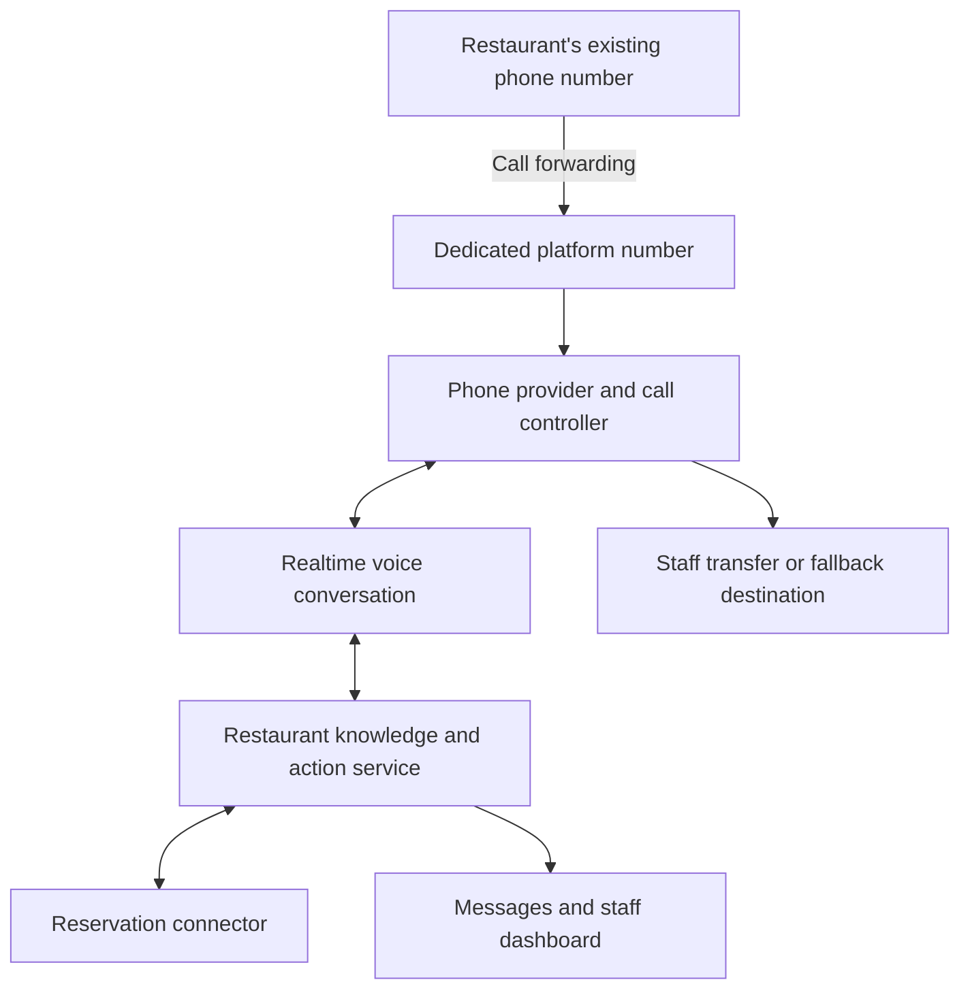

# AI phone receptionist: restaurant pilot

Status: product brief for the accepted request-only pilot. A local synthetic dashboard, simulator, staff inbox, and tenant-isolated persistence are implemented. The optional phone gateway is an FAQ-only sandbox awaiting real-provider verification; live request submission and staff transfers are still pending. The sections below describe the target pilot. See [implementation status](docs/IMPLEMENTATION_STATUS.md) for delivered behavior and [the implementation plan](docs/IMPLEMENTATION_PLAN.md) and [architecture](docs/ARCHITECTURE.md) for the detailed design.

## Product goal

Answer restaurant phone calls through natural conversation, using restaurant-approved information and a small set of reliable actions. A shared platform serves multiple restaurants; each restaurant configures its own knowledge, hours, reservation rules, transfer destinations, and permitted actions.

The restaurant keeps its current number by forwarding calls to a dedicated platform number. Confirm forwarding behavior, caller-ID preservation, transfer behavior, and failure routing with the selected phone provider during the pilot.

## First pilot

Start with one restaurant location, one language, one phone provider, and reservation requests that staff confirm. Build reusable connector infrastructure with disabled OpenTable and Resy adapters from the start; enable live vendor operations only after official API access, restaurant authorization, and conformance tests establish supported capabilities.

Starting with reservation requests means launching without a connection to reservation software. The restaurant may still use its existing software or a manual reservation book; staff review each request and confirm it through their usual process. For example: "I've passed your request for four people on Friday at 7 PM to the restaurant. Your table is not confirmed yet; staff will contact you using the details you provided." Configure this wording to match the restaurant's actual follow-up process.

The first four caller workflows are:

1. **Ask a question.** Answer hours, location, parking, menu items, published prices, accessibility, and restaurant policies from approved information. Ask a clarifying question when needed. Refer unsupported questions to staff. Give only documented dietary information and refer allergy and cross-contamination questions to staff; do not guarantee that a meal is safe.
2. **Request a table.** Collect party size, date, time, name, contact details, and relevant seating requests. Read back the details before saving one request for staff review and tell the caller explicitly that it is not confirmed. In a later enabled live-booking mode, confirm a reservation only after the authoritative system reports success and returns a reservation reference.
3. **Speak to staff.** Transfer promptly when requested or when a restaurant rule requires escalation. Pass a concise summary through a supported staff channel. If nobody answers, offer to take a message. Configure destinations that cannot forward back into the AI number and create a transfer loop.
4. **Leave a message.** Collect the caller's name, callback number, reason, and any preferred callback time. Verify that the message was saved and track its delivery. Use only restaurant-approved callback expectations.

Existing reservation lookup and changes can follow once verification rules and connector capabilities are established. Takeout ordering, payments, multiple reservation connectors, voiceprints, and synthetic-voice detection are later phases.

## Example call

> Agent: "Thanks for calling Harbor Table. I'm the restaurant's AI receptionist. How can I help?"
>
> Caller: "Can I book dinner for four tomorrow around seven?"
>
> Agent: Resolves "tomorrow" in the restaurant's timezone and explains that it can submit a request for staff confirmation.
>
> Agent: Collects the required details and asks the caller to confirm the exact date, time, party size, and name.
>
> Agent: Saves one request after the caller agrees and says that the table is not confirmed yet. Staff check the restaurant's existing system, record the result, and contact the caller according to the approved follow-up process.

Later, a separately enabled live-booking connector can check authoritative availability and confirm a reservation only after a successful vendor write. An uncertain write goes to reconciliation and must not be represented as a confirmed booking.

## Core architecture

- **Call controller:** Validate provider webhooks, map the called platform number to the restaurant, load configuration, manage the audio session, and handle transfers and disconnects. Keep the voice service separate from slow background tasks. Handle interruptions, silence, noisy audio, and loss of the voice connection.
- **Voice agent:** Converse naturally, retrieve restaurant facts, clarify ambiguous requests, and request approved tool actions. Treat caller speech and retrieved text as data. The model cannot add permissions or bypass action validation.
- **Action service:** Enforce tenant ownership and permitted actions on every request. Validate dates, party size, opening hours, booking rules, and tool parameters. Require caller confirmation before booking. Use idempotency and result reconciliation to prevent duplicate bookings after retries, timeouts, or webhook replay.
- **Knowledge service:** Store structured hours, exceptions, menu information, policies, and approved FAQs. Track who approved each update and when it became effective. Prefer structured data for prices and hours. Define what to do when facts are missing, expired, or conflicting.
- **Connectors:** Provide reusable capability contracts such as checking availability and creating reservations. Describe unsupported operations explicitly. Use official authorized integrations; an assumed vendor API is not a dependency that is ready to use.
- **Reservation capacity:** Keep the restaurant's reservation system authoritative for table availability. A generic appointment calendar alone does not represent table combinations, seating durations, or dining-room capacity.
- **Business dashboard:** Edit restaurant details, configure transfers and allowed actions, approve knowledge, review messages and call outcomes, fulfill reservation requests, and manage integration status. Initial request delivery is to this authenticated dashboard; additional staff notification channels are separately configured integrations.
- **Storage and jobs:** Store restaurants, configuration revisions, calls, tool outcomes, reservation references, messages, and delivery status in a tenant-scoped database. Use background jobs for delivery and reconciliation. Keep provider credentials on the server.

The implemented baseline is a TypeScript/pnpm monorepo with a React/Vite dashboard, Fastify API, separate Node.js voice gateway for persistent streaming connections, Node.js worker, optional development OIDC staff authentication, and PostgreSQL with a durable outbox. PGlite supplies the embedded PostgreSQL engine for the local synthetic demo; a native `pg` adapter supports separately provisioned development environments. Twilio Media Streams and OpenAI Realtime supply the phone sandbox integration code. Actual account interoperability, audio behavior, provider limits, privacy settings, and deployment requirements still need verification before live rollout.

## Restaurant configuration

Each location needs a name, timezone, business hours and holiday exceptions, address, greeting, approved menu and FAQs, reservation rules, connector configuration, transfer destinations, escalation rules, fallback destination, and message-delivery preference. Keep permissions constrained and validated for the first pilot.

Disclosure, recording, retention, and access settings need to match the pilot's operating region and restaurant requirements. Recording should be an explicit configuration choice. Restrict access to contact details, reservation data, and call records; use a defined retention period.

Caller ID and a matching voice are recognition signals, not proof of identity. Sensitive operations require separate verification rules. If voiceprints are added later, use verified enrollment, explicit consent, revocation and deletion, and evaluate false matches, missed matches, and spoofing risk. Synthetic-voice detection remains a risk signal and must not establish identity by itself.

## Build sequence

1. **Conversation prototype:** A restaurant configuration screen and simulated calls with a mock reservation system. Exercise FAQs, table requests, messages, and escalation before connecting a public number.
2. **Real calls:** Connect one phone number and realtime audio. Verify interruption handling, transfers, unanswered transfers, disconnects, and configured fallback behavior.
3. **Reservation workflow:** Complete the staff inbox and request fulfillment first. Establish shared connector contracts and disabled OpenTable/Resy adapters; implement and enable each authorized live connector as a separate later phase.
4. **Pilot:** Use the restaurant's approved knowledge and staff destinations. Test first on a dedicated number, then enable forwarding when the restaurant is ready. Review failed calls and staff corrections before expanding to more restaurants.

## Acceptance scenarios

- A caller asks for Sunday hours and a menu price; answers match the effective approved configuration, including holiday exceptions.
- A caller asks for an unavailable table; the agent offers supported alternatives or submits an explicitly unconfirmed request.
- Two callers compete for the same table, or a booking API times out after accepting a write; the system reconciles the outcome and creates no duplicate reservation.
- A caller interrupts with "I want to speak to someone"; the agent starts the transfer promptly. Unanswered or failed transfers lead to a message option.
- A caller asks whether food is safe for a severe allergy; the agent passes the question to staff without inventing a safety assurance.
- A caller provides an ambiguous date or time; the agent resolves it in the restaurant's timezone and reads back the exact details before submission.
- A repeated webhook or dropped audio session does not create duplicate messages or bookings.
- One restaurant's caller cannot access another restaurant's configuration, messages, reservations, or credentials.
- An after-hours call follows the restaurant's configured rules and does not invent staff availability or promise an unapproved callback time.

Measure confirmed reservation accuracy, transfer completion, message delivery, caller abandonment, response latency, staff correction rate, and cost per handled call. Review these alongside successful FAQ answers; low handoff rates alone do not prove that callers received correct help.

## Current workspace status

The local prototype now includes persistent synthetic restaurants, configuration editing, a deterministic conversation simulator, explicit request/message confirmation, and a staff fulfillment workflow. The selected phone and voice accounts will be configured through environment secrets; code and mocked tests do not establish a working live line. Resy/OpenTable access, OIDC provider selection, production infrastructure, and pilot approval remain external dependencies.

Run the demo using [README.md](README.md), then consult [implementation status](docs/IMPLEMENTATION_STATUS.md) and [voice setup](docs/VOICE_SETUP.md) for the next verification milestone. Production startup is intentionally blocked until the outstanding security and operational requirements are implemented and reviewed.
