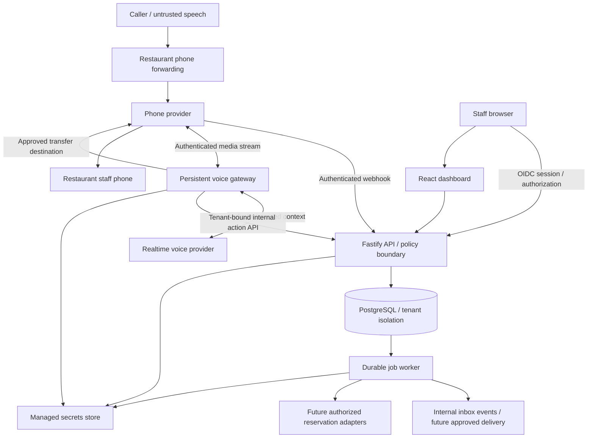
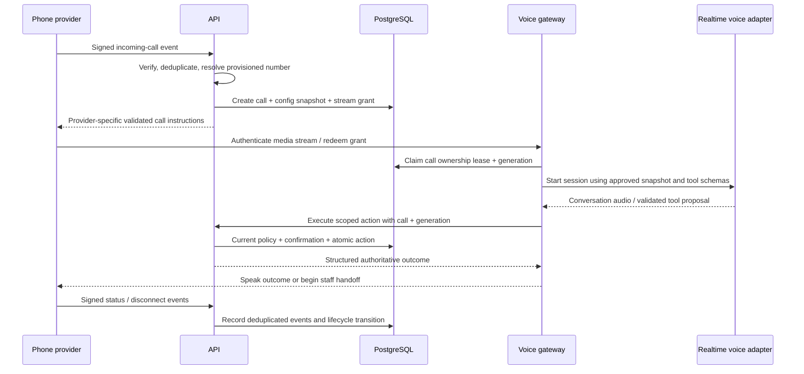
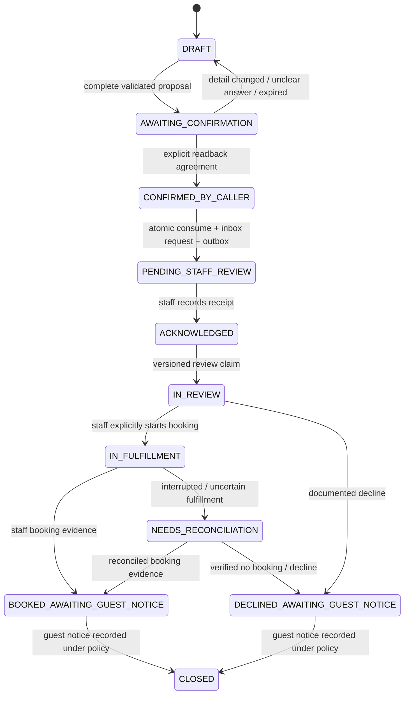
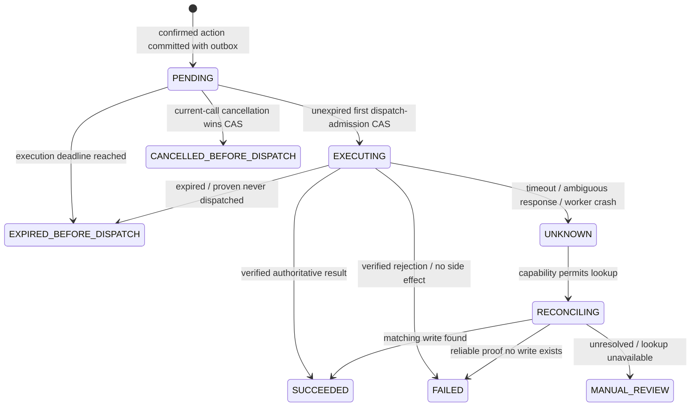

# Proposed system architecture

Implementation evidence: see [current prototype status](IMPLEMENTATION_STATUS.md) and [ADR-009](adr/009-local-prototype.md). The requirements below include later pilot and production work; they are not all implemented.

Status: design for implementation; no application, deployed infrastructure, provider access, or production behavior is implied. The restaurant pilot accepts **reservation requests for staff review**. A saved or delivered request is never a confirmed reservation.

Read this with [the product brief](../BUILD_BRIEF.md), [the implementation plan](IMPLEMENTATION_PLAN.md), [integration contracts](INTEGRATIONS.md), [the data model](DATA_MODEL.md), [security requirements](SECURITY.md), [operations](OPERATIONS.md), [testing](TESTING.md), and [engineering conventions](ENGINEERING.md). Provider-specific details remain subject to documented capability checks.

## 1. Scope and architectural decisions

The initial product serves a restaurant location through four workflows: approved FAQs, reservation requests, staff transfers, and messages. A restaurant forwards its existing number to a dedicated platform number. The platform does not initially calculate table inventory, accept payments, place orders, change existing reservations, or authenticate callers by voice.

The same core serves multiple restaurants. A business is a tenant; a tenant can own multiple locations. Start with one pilot location, but retain explicit location ownership in configuration, calls, requests, and connectors. A location has its own timezone, called number, hours, approved information, staff destinations, and action policy.

| Decision                                | Reason and consequence                                                                                                                                                                                                                |
| --------------------------------------- | ------------------------------------------------------------------------------------------------------------------------------------------------------------------------------------------------------------------------------------- |
| TypeScript, pnpm workspace              | Shared validated contracts across services; compile-time types supplement runtime validation.                                                                                                                                         |
| React/Vite dashboard                    | Staff can configure the location, publish approved knowledge, and review requests without coupling the UI to media processing.                                                                                                        |
| Fastify API                             | Owns authentication, authorization, policy, transactional business changes, and staff APIs.                                                                                                                                           |
| Separate Node voice gateway             | Long-lived authenticated WebSocket audio sessions need a suitable persistent process and bounded low-latency work.                                                                                                                    |
| Separate Node worker                    | Internal inbox events, reconciliation, and future connector/delivery calls survive call disconnects and process restarts.                                                                                                             |
| PostgreSQL with outbox and leased jobs  | Durable state, tenant constraints, and atomic enqueueing without requiring Redis in the pilot.                                                                                                                                        |
| External OIDC identity provider         | Staff identity, MFA, and login lifecycle are delegated; application roles remain enforced locally.                                                                                                                                    |
| Provider adapters                       | Keep telephony, realtime voice, delivery, and reservation vendors replaceable. Twilio Media Streams and OpenAI Realtime are implemented as a gated sandbox bridge; account interoperability and live-call behavior remain unverified. |
| Capability-gated reservation connectors | The future OpenTable and Resy infrastructure uses official authorized access; unsupported or unverified capabilities remain unavailable.                                                                                              |

Proposed source layout:

```text
apps/
  dashboard/       # staff UI, no provider secrets
  api/             # public webhooks + staff APIs + internal action APIs
  voice-gateway/   # media sessions, conversation orchestration, phone control
  worker/          # durable jobs, delivery, reconciliation, connector execution
packages/
  domain/          # policies, state machines, date handling, domain services
  contracts/       # versioned schemas, API/event/tool contracts
  connectors/      # provider interfaces, mock adapters, authorized integrations
  config/          # validated runtime configuration
  observability/   # redaction, structured logs, metrics, tracing helpers
infra/             # repeatable deployment, secrets references, alerts, runbooks
```

Keep interfaces narrow. Domain packages must not depend on Fastify, UI components, or a vendor SDK. Contracts are authoritative runtime schemas; importing a TypeScript interface alone does not validate a webhook or model-generated tool argument.

## 2. Components and trust boundaries



The diagram shows logical trust boundaries, not deployment permissions. Implement least-privilege network and database permissions per component.

| Boundary                        | Required controls                                                                                                                                                                                                                                      |
| ------------------------------- | ------------------------------------------------------------------------------------------------------------------------------------------------------------------------------------------------------------------------------------------------------ |
| Public caller to platform       | Caller speech, caller ID, uploaded audio, and prompted tool arguments are untrusted. Caller ID selects no tenant permissions and proves no identity.                                                                                                   |
| Phone provider to API           | Verify the provider's documented signature over its required raw input/canonical URL, expected account, freshness where available, and replay identity before processing. Configure trusted proxies explicitly.                                        |
| Phone provider to media gateway | Use the selected adapter's documented stream authentication. When supported, add short-lived, one-use stream grants bound to provider account, call ID, tenant, location, and session generation; never trust a tenant ID supplied in stream metadata. |
| Gateway to voice provider       | Server-held credentials, configured endpoint allowlist, minimal approved context, validated events, bounded payloads, and no direct database or arbitrary HTTP tools.                                                                                  |
| Gateway/worker to API/database  | Distinct service identities and audiences, scoped actions, tenant context derived from authenticated call/job records, and current policy checks. Internal traffic is authenticated even on a private network.                                         |
| Staff browser to API            | OIDC validation, secure application session, CSRF protection for cookie authentication, local active membership and role checks, tenant resource ownership, and rate limits.                                                                           |
| API/worker to external vendors  | Approved credential reference and restaurant scope, narrow adapter capabilities, timeouts, response validation, SSRF defenses, retry classification, and an operation ledger.                                                                          |
| Runtime to operators            | Redacted telemetry; production access restricted and audited. Access to one tenant does not grant production-wide support access.                                                                                                                      |

Provider tenant resolution is a privileged lookup: match an authenticated provider account and an active, canonical dedicated called number to a provisioned location. Reject unknown or ambiguous mappings. Implement this as a narrowly scoped control-plane registry/function returning only mapping and tenant/location references, not unrestricted runtime access to tenant tables. Pin `search_path` and restrict `EXECUTE` for any security-definer function. Do not use a caller-supplied tenant header, model output, or an unverified forwarded-from number for this lookup. Number provisioning and reassignment must require verified restaurant ownership and preserve mapping history; active call records retain their original location.

## 3. Inbound call and media lifecycle



1. Validate the inbound event before making tenant data available. Deduplicate with the provider's stable event identifier and account where available; document a deterministic fallback if a vendor does not provide one. A duplicate receives a stable compatible response and does not create another call.
2. Persist the call, the effective approved configuration revision, consent/disclosure settings, and any stream grant. The API returns provider-specific instructions only after this transaction succeeds.
3. The gateway authenticates the stream and acquires a fenced ownership lease. A reconnect increments the generation only under the documented resume policy. There is one active conversation controller per call; old generations cannot issue new actions or overwrite current state.
4. The gateway holds transient audio buffers in memory. Bound queue depth and payload sizes; apply backpressure or terminate degraded sessions rather than growing memory. Do not write raw audio to PostgreSQL or logs.
5. Disclose the AI role at greeting. Apply the restaurant's approved disclosure and transcript policy before retaining content. Realtime audio processing occurs even when retention is off, and must be covered by provider terms and configuration.
6. Tools receive a derived tenant/location/call identity from the gateway service principal. Tool arguments cannot override these identifiers. Validate tool name, schema, state, policy, quotas, and confirmation server-side.
7. On confirmed disconnect, revoke the stream grant and controller's ability to start new caller actions. Already committed requests and messages continue delivery; a submitted external write continues reconciliation without inventing fresh caller authority.

The media gateway is not a general background executor. Availability lookups or future connector operations use bounded asynchronous jobs; the call can wait briefly, offer staff help, or explain a pending outcome. Do not hold a database transaction or row lock while performing a vendor network call.

### Session behavior and failure handling

- Implement interruption handling in the provider adapter: stop queued playback and cancel applicable generation when a caller interrupts. Do not cancel a committed write or treat an interruption as proof that a submitted operation failed.
- Prioritize a request for staff over continuing FAQ responses. A configurable silence/noise policy makes a limited number of prompts before fallback; the model must not create business actions from silence or uncertain speech.
- Heartbeats renew controller leases; status callbacks and transport closure are independent signals. Use a defined grace window before recovery, but reject stale generation writes throughout. A missing WebSocket is not evidence that a reservation write failed.
- If the voice provider fails, use an approved static apology and provider-level transfer/fallback when supported. If the gateway or platform is unreachable, the phone provider must have tested fallback instructions that do not depend on the failed service.
- Set hard call-duration, concurrent-call, action-frequency, token, and cost limits. Reaching a limit follows a safe fallback rather than repeating an open-ended conversation.
- Call status events may be duplicated or out of order. Transition through monotonic state rules; retain event time and receipt time for audit. A late `connected` callback cannot reopen an ended call.

## 4. Conversation facts, snapshots, and revocation

Configuration publication creates an immutable approved revision. A call pins its initial revision so changes to wording, knowledge, or ordinary hours do not unpredictably alter an ongoing conversation. Retain the revision identifier with decisions.

A snapshot is not permanent authorization. Every action checks current tenant/location status, capability enablement, connector validity, staff destination allowlist, applicable rules, quotas, and emergency revocation version. Disabling booking, a compromised connector, a revoked staff destination, or a suspended tenant takes effect on the next action. The gateway checks revocation during periodic session heartbeats and stops an affected session where needed.

Safety-critical knowledge corrections, such as an allergy policy correction or emergency closure, invalidate affected pinned facts. Mark facts by category and provide a current revocation/invalidation check before retrieving them. If the call cannot refresh safely, hand off; do not continue answering a revoked fact. A relevant hours/rules revision change between collection and submission invalidates the pending action confirmation and requires a new readback.

Prefer structured hours, menu prices, reservation constraints, and policy fields. Free-text FAQs need approval, source metadata, review dates, and conflict handling. Start with direct lookup over the small approved corpus. Semantic retrieval can be added later but may return only tenant-scoped, approved, effective records. Citations/source IDs stay internal; the caller receives a natural answer.

Caller speech, retrieved content, delivery messages, and connector results are data, even if they contain instructions. The model never receives credentials or a tool that accepts an arbitrary endpoint, SQL statement, transfer number, tenant ID, or new permission. For dietary questions, answer documented facts and route allergy or cross-contamination judgments to staff.

## 5. Reservation requests and caller confirmation

Request-only mode does not query or reserve inventory. It collects a date, time, party size, name, callback details, and optional bounded seating note, subject to restaurant request rules. A request for an unusual party size or closed period may require staff escalation, but it must not be described as unavailable based on invented table capacity.



`CONFIRMED_BY_CALLER` means approval to submit the request. Inbox acknowledgement is not a reservation. `BOOKED_AWAITING_GUEST_NOTICE` in the pilot requires staff-reported booking evidence and is visibly distinguished from future provider-verified booking. Guest notice is separate and cannot be inferred from either. See [the data model](DATA_MODEL.md) for the distinct status/evidence fields and [integration contracts](INTEGRATIONS.md) for permitted transitions.

The pilot delivery channel is the authenticated dashboard inbox: a committed request is available there immediately. No automatic email, SMS, Slack, or external staff notification is enabled. Internal outbox jobs support reliable events and operational follow-up; they do not determine whether the database-backed inbox exists. Future external channel acceptance/delivery/read states remain separate from inbox acknowledgement and booking fulfillment.

Staff claim review using a versioned lease. Before booking in their existing system, staff explicitly start `IN_FULFILLMENT` and record an operation/actor reference. A review lease can expire safely before fulfillment; once fulfillment begins, expiry or interruption instead places the work on a `NEEDS_RECONCILIATION` hold. Staff must check their existing system before another booking attempt. The platform cannot technically fence a staff member's direct writes to a third-party website; visible holds, evidence, and training are required. Changed final booking details require recorded guest agreement. Guest notice and booking-evidence provenance are independent fields.

The confirmation boundary is a server-side domain service:

1. Validate a canonical proposal and store a short-lived proposal ID, digest, revision, action kind, tenant/location/call, conversation turn, and expiry. Resolve relative dates using the server-recorded start timestamp of the relevant caller utterance in the restaurant's timezone; persist that reference timestamp/turn with the proposal. Do not use call start or later worker time. Freeze the resolved explicit date once read back and confirmed; a new relative-date correction uses its own utterance timestamp and requires a new readback. Use a deterministic digest over a versioned canonical representation.
2. Generate the readback from the server's canonical proposal: full exact date with timezone, time, party size, name, callback details, and any material action detail. The controller binds the final delivered readback turn to its digest; interrupted playback is incomplete and requires another readback. Offer correction. A generic earlier “yes” cannot approve a later proposal.
3. Conversation orchestration detects an explicit agreement associated with that readback turn; ambiguity, low-confidence transcription, interruption, changed details, or a request for staff cancels the pending confirmation. Repeat rather than assume.
4. The model can propose a confirmation intent, but cannot manufacture an arbitrary reusable confirmation token. The service validates current call generation and turn linkage, issues/records a confirmation bound to the proposal digest, and exposes its ID only to the trusted controller.
5. Submission atomically verifies active call/generation, current authorization, unchanged proposal, and an unexpired unused confirmation; consumes it; writes the request directly into the authenticated staff inbox; and creates its outbox event. Retrying the same action returns the saved request. Reusing confirmation for a different action is rejected.

Spoken agreement is product consent to the specified action, not customer identity verification. Constrained model interpretation of speech can still make mistakes: confirmation readback, conservative ambiguity handling, repeatable simulations, and sampled pilot review are required. Sensitive future lookup/change flows need an independent verification grant; caller ID, confirmation, voiceprint, and synthetic-voice scores do not supply that grant.

The voice response follows durable state:

| Known state                                                 | Allowed wording                                                                                                          |
| ----------------------------------------------------------- | ------------------------------------------------------------------------------------------------------------------------ |
| Request committed and available in staff inbox              | “I've saved your reservation request for staff review. Your table is not confirmed.”                                     |
| Future external delivery acknowledged by configured channel | “I've sent your request to the restaurant. Your table is not confirmed; staff will follow up according to their policy.” |
| Database submission failed                                  | “I couldn't save the request. I can connect you to staff or take another approved next step.”                            |
| Future booking outcome unknown                              | “I don't yet have confirmation. Please don't submit another booking while we check; I can arrange staff help.”           |
| Future booking authoritatively confirmed                    | State only the confirmed details and returned reservation reference permitted by policy.                                 |

Use server-authored outcome wording for action status, including the mandatory unconfirmed-request distinction; the model may not paraphrase a saved request into a confirmed booking. Delivery acknowledgement is not staff attention. Never promise a callback window without a configured and realistic restaurant commitment. Disconnect after commit does not delete the request; disconnect before confirmed submission does not silently submit a draft.

## 6. Future reservation connector infrastructure

Define normalized capability contracts now and implement a mock connector plus request-only behavior first. Provider names do not imply capability availability. OpenTable and Resy adapters must remain disabled placeholders until official access, contractual permission, restaurant linking, credential scope, sandbox behavior, idempotency, reconciliation, and data handling are verified. No scraping, reverse-engineered private endpoints, or staff-password automation is part of the plan.

Use a tenant/account integration installation and a location-level connector instance with an explicit capability snapshot and health state. The initial future contracts are `checkAvailability`, `createReservation`, `readReservation`, and `reconcileWrite`; each is enabled only after evidence and acceptance tests. Modification/cancellation require new contracts and review. Capability downgrade or credential revocation immediately blocks new actions. The vendor remains authoritative for seating inventory and reservation status.

An external mutation follows an operation ledger:



An expired worker lease after execution began is `UNKNOWN`, not permission to repeat the external write. Reconcile using a vendor-supported idempotency key, stable external reference, or verified lookup method. A retry after uncertainty requires an adapter contract that proves it is safe; otherwise stop automatic writes and queue staff review. New requests for the same business intent must check outstanding unknown operations, not merely create a new idempotency key.

Every future live booking, including a staff-origin write, persists an immutable `execute_before` UTC instant with its approved intent. Derive it from the earliest applicable caller-agreed latest start, verified offer expiry, and restaurant maximum-wait policy; explain the bounded wait when seeking agreement. This is separate from confirmation-token expiry, job leases, and per-attempt network timeouts. The first dispatch-admission transaction requires database time strictly before `execute_before`. Recheck immediately before the network send, including after journal publication, rate-limit waits, or backoff. If time has expired and the current fenced owner can prove no attempt was sent, finish as `EXPIRED_BEFORE_DISPATCH`; do not extend the deadline or reset that operation. A fresh booking requires fresh agreement and a new linked operation after confirming the old one never dispatched. If any attempt was sent or may have been sent, expiry cannot prove failure or cancellation: keep its outcome/reconciliation workflow, including after call disconnect. This deadline limits starting a vendor write; it does not expire saved request inbox items or stop recovery of an already attempted write.

For a future committed vendor action still `PENDING`, explicit cancellation from the same active call/current generation atomically competes with the worker's first dispatch-admission compare-and-set. Cancellation winning creates `CANCELLED_BEFORE_DISPATCH`, invalidates its queued write, and guarantees no dispatch. Admission winning closes this cancellation boundary, even if the caller hears no result yet. After admission, report pending/uncertain outcome and reconcile; do not claim cancellation, retry blindly, or issue an automatic vendor cancel. The worker rechecks current authorization/capability/revocation before admission. Abandoning a draft is different from changing an already saved request, which follows staff workflow in the pilot. Call disconnect alone preserves durably committed requests/actions.

After dispatch admission and before any vendor network write, append minimal immutable dispatch-intent evidence to a restricted recovery journal outside the primary database's restore/rollback domain and wait for durable acknowledgement. No acknowledgement means no dispatch; missing or partial evidence leaves a hold for recovery review. Record resulting success/rejection/uncertainty in that journal as well as the operation ledger. This is not a distributed transaction, and a journalled intent is not proof a write executed or succeeded. Its purpose is to prevent restoring PostgreSQL from silently forgetting an already attempted write. A restored system quarantines jobs and disables write egress, replays journal/deletion evidence, and reconciles every possibly attempted operation before any redrive. The independent journal needs explicit privacy, encryption, access, retention, failure, and availability policies; see [operations](OPERATIONS.md) and [the data model](DATA_MODEL.md).

No dispatch evidence is not approval to send restored pending work: a later cancellation or changed guest intent may also have been rolled back. Require fresh operation-specific approval after staff verify current guest intent, and recheck current restaurant/connector permission before any such new dispatch. Do not automatically redrive pre-restore write jobs, even when their restored state is `PENDING`.

Before external dispatch, unavailable capability can fall back to an unconfirmed request after caller agreement. After dispatch with an unknown result, any staff inbox item references the existing operation and uses a `NEEDS_RECONCILIATION` hold; it cannot become an independent actionable request or manual duplicate booking. Mere absence from an eventually consistent or paginated vendor search is not definitive failure evidence.

Availability is a read, not a lock. Offers expire, caller changes invalidate confirmation, and a vendor can reject a slot won by another caller. Revalidate where supported at submission and trust the authoritative create result. Do not construct local table inventory or assume a lock in PostgreSQL reserves vendor seating.

When a call ends, execute only operations already durably submitted with valid authorization and an unexpired execution deadline. Background execution rechecks emergency revocation and capabilities; an operation revoked before dispatch becomes blocked. If an external write has already started, reconcile and audit it even after revocation or execution-deadline expiry. Notify only through consented channels and configured staff procedures; an ended call is not permission to initiate another call or text.

## 7. Staff handoff and message flow

Transfer targets are approved location-owned destination IDs. The action service resolves the destination; neither caller speech nor model output may select an arbitrary number. Check E.164 format, configured business hours/after-hours routing, country restrictions, loop prevention, and current revocation. Known platform inbound numbers and forwarding destinations that loop back into the receptionist are invalid targets. Keep a maximum transfer count and call-hop policy.

Persist a transfer attempt and minimal approved handoff summary before issuing phone-control commands. The gateway may execute the command under its current fenced call ownership; the operation ledger records command dispatch and uncertain outcomes. Worker reconciliation consumes authenticated status callbacks or a supported provider lookup. It does not blindly repeat an ambiguous transfer command.

Use provider-supported supervised transfer/bridge behavior only after verification. Establish and observe the staff leg before releasing AI control when the provider supports this. Stop AI playback and further caller tools once the staff leg is bridged. A provider leg `answered` can mean voicemail or an IVR; report a connected leg, not proven human receipt. Unsupported warm transfer features must have an explicit simpler tested fallback.

| Transfer outcome             | Behavior                                                                                             |
| ---------------------------- | ---------------------------------------------------------------------------------------------------- |
| Staff leg connected          | Complete supported handoff and end AI participation; record provider evidence.                       |
| Busy, rejected, or no answer | Retain/resume caller session if supported; offer a message or an approved alternate.                 |
| Outcome uncertain            | Observe/reconcile before a new leg; never create a second simultaneous transfer by assuming failure. |
| Caller disconnects           | Stop dialing/cancel unconnected staff leg where supported; retain audit and committed messages.      |
| Platform failure             | Use provider-configured fallback; no dependency on the failed model or database for its destination. |

A staff summary may contain caller-provided details only within the location's configured delivery policy. The pilot stores this context in the authenticated dashboard; no external messaging channel or private spoken whisper is assumed. Do not speak a private staff summary on the shared caller leg. Future handoff channels must verify staff-only access; omit sensitive details when that channel cannot establish recipient access. An unavailable summary must not prevent a requested human transfer when the transfer itself is possible.

Messages use the same proposal/readback/confirmation and atomic saved-record/inbox/outbox pattern as requests. Inbox acknowledgement, future external message delivery, and callback completion are different states. Staff can mark ownership and disposition; the system does not imply that an available/delivered message was read or a callback occurred.

## 8. Staff identity, tenant isolation, and API shape

The selected pilot provider is Auth0 Universal Login through a server-owned OIDC BFF, with validated signed ID tokens, issuer/audience/state/nonce, fresh MFA, encrypted one-use login grants and hashed shared sessions. See [ADR-011](adr/011-identity-and-cloud-foundations.md) and [Auth0 setup](AUTH0_SETUP.md). API authorization evaluates the authenticated subject's active local membership for the requested tenant, role, and location scope. OIDC claims are not accepted as arbitrary tenant memberships.

Suggested roles: owner manages membership and location policy; manager publishes knowledge and handles integration configuration; host reviews requests/messages and records dispositions; read-only reviewer sees approved limited records. Platform support has a separate audited, time-limited access path. Avoid introducing broad production access through an ordinary restaurant role.

Require application ownership checks plus PostgreSQL row-level security for tenant tables, composite foreign keys for tenant/location relationships, and restricted database roles. Enable and force RLS as required; runtime API/worker roles neither own tenant tables nor have `BYPASSRLS`. Set tenant context transaction-locally after authentication and verify it is present. Connection pooling must not leak session context between tenants. A separate narrow dispatcher/claim function discovers bounded tenant/job references without caller content. Workers validate their association against the trusted claim, then enter an explicit tenant scope; an arbitrary job payload cannot choose a tenant or bypass isolation.

Proposed first-party API contracts, subject to implementation review:

| Surface          | Representative contract                                              | Authorization and behavior                                                                                                                                 |
| ---------------- | -------------------------------------------------------------------- | ---------------------------------------------------------------------------------------------------------------------------------------------------------- |
| Staff            | `GET /v1/tenants/:tenantId/locations/:locationId`                    | Active membership plus location scope; approved response fields only.                                                                                      |
| Staff            | `POST .../config-revisions`, `POST .../config-revisions/:id/publish` | Separate edit/publish permissions; optimistic version check and approval audit.                                                                            |
| Staff            | `GET .../reservation-requests`, `PATCH .../reservation-requests/:id` | Scoped role; versioned disposition update; no vendor reservation implication.                                                                              |
| Staff            | `GET .../messages`, `PATCH .../messages/:id`                         | Scoped host/manager actions; redacted response where role requires it.                                                                                     |
| Staff            | `GET .../integrations`                                               | Capability/health status only; never return credential values.                                                                                             |
| Internal         | `POST /internal/v1/calls/:callId/proposals`                          | Authenticated gateway, active generation, call-derived tenant/location, typed action.                                                                      |
| Internal         | `POST /internal/v1/calls/:callId/confirmations`                      | Valid proposal and linked readback/agreement turn; bound expiry.                                                                                           |
| Internal         | `POST /internal/v1/calls/:callId/actions`                            | Current policy, unused confirmation where required, stable idempotency key.                                                                                |
| Internal         | `POST /internal/v1/calls/:callId/actions/:actionId/cancel-pending`   | Future vendor actions only: same active call/current generation; atomic race with first dispatch admission. Saved request changes remain a staff workflow. |
| Internal         | `GET /internal/v1/calls/:callId/actions/:actionId`                   | Same service/call scope; typed durable outcome, minimal fields.                                                                                            |
| Provider webhook | Adapter-specific public route                                        | Vendor-documented verification, account binding, deduplication, body limits.                                                                               |
| Media            | Adapter-specific WebSocket route                                     | Provider authentication and bound stream grant; strict schema, frame limits.                                                                               |

These are platform API examples, not Resy, OpenTable, Twilio, or OpenAI endpoints. Use an OpenAPI document and shared schemas when implementing. Public staff errors avoid revealing cross-tenant resource existence. Internal action responses use an explicit discriminated outcome, such as `saved_pending_staff_review`, `confirmed_reservation`, `expired_before_dispatch`, `blocked`, `failed`, or `unknown`; future external delivery has its own outcome. Do not flatten them to a misleading `success: true`.

All mutation contracts require stable idempotency keys, expected record versions when appropriate, a correlation ID, and validated limits. Reusing a key with a different canonical payload fails. HTTP retry safety and external side-effect retry safety are separate guarantees.

## 9. Durable transactions, workers, and deployment

Each business mutation and its outbox event commit together. A narrow dispatcher materializes a job from an outbox event exactly once through a unique event key; execution remains at least once. It returns bounded trusted job/tenant references to ordinary workers, not caller content or general cross-tenant access. Jobs use leases, attempt limits, next-run times, classified errors, dead-letter/manual-review states, and ownership fencing. Keep external side effects deduplicated separately. Future staff notification channels without idempotency may deliver duplicates after a crash; use a stable request/message reference and document the limitation.

Claims use short transactions and row locking such as `FOR UPDATE SKIP LOCKED`; finish/retry requires the current lease token. Leases keep local ownership orderly, but cannot undo an external effect. Job payloads carry record identifiers and a version, not secrets, transcripts, or all customer data.

The prepared AWS deployment uses CloudFormation, ECS Fargate API/gateway/worker services, public and private HTTPS load balancers, private RDS PostgreSQL, Secrets Manager, and CloudWatch. Retained data/network/recovery resources are separate from the replaceable application stack. [AWS deployment](AWS_DEPLOYMENT.md) describes the disabled-until-configured main pipeline and manual redeploy/logs/cleanup. Deploy API, gateway, and worker independently. The gateway requires a runtime with persistent WebSocket support, TLS, controlled draining, and latency close to selected providers. Avoid an ephemeral request-only runtime for media. A load balancer must support the verified provider's stream duration and authentication scheme. Sticky routing may help connection handling but is not a substitute for fenced ownership.

Use managed PostgreSQL with private network access, encryption, automated backups, and tested restore. Maintain restore-independent minimal deletion evidence; future vendor writes also require independent dispatch-intent/outcome journalling before enabling them. Restoring a database must start with quarantined jobs/write egress until deletion replay and operation reconciliation complete. Use a managed secrets store or equivalent runtime secret injection with per-component access, rotation, and no committed credentials. Raw recording is off by default. If later enabled, store recordings in a controlled object store with tenant ownership, region and retention rules, encryption, and audited expiring access; never make the bucket public.

Recovery also creates a new authentication/recovery epoch in a control plane outside the database rollback domain. Invalidate every recovered session, media grant, controller/job lease, pending confirmation, and staff approval; suspend tenant admission and sensitive actions. Restored membership, tenant status, phone routing, transfer destinations, and connector permissions may predate revocation or number reassignment. Reopen each scope only after replaying trustworthy independent security decisions or explicit owner/provider reauthorization verified against current authority, not restored memberships/grants. The current epoch and recovery checkpoint must not themselves be rolled back with PostgreSQL. Fresh staff login alone does not validate a recovered location's routing or connector permission. Keep affected scopes closed while independent coverage or authority is uncertain.

Deployment readiness requires an actual provider proof for signatures, media format, cancellation, transfer callbacks/fallback, stream authentication, caller-ID forwarding, data residency, and outbound write semantics. Infrastructure-as-code, migrations, staging, rollback, observability, and operational budgets are specified in [operations](OPERATIONS.md) and [the implementation plan](IMPLEMENTATION_PLAN.md).

## 10. Design review and remaining dependencies

This design closes several common gaps by making business state authoritative, separating request delivery from confirmation, fencing call owners, using atomic outbox writes, and treating unknown external outcomes as reconciliation work. Implementation must prove these controls; prose alone does not provide them.

| Dependency or gap                     | Required resolution before relevant release                                                                                                                                                                                                   |
| ------------------------------------- | --------------------------------------------------------------------------------------------------------------------------------------------------------------------------------------------------------------------------------------------- |
| Pilot restaurant and operating region | Approve actual hours, request rules, languages, follow-up process, transfer numbers, disclosure, and retention.                                                                                                                               |
| Phone/media provider capabilities     | Demonstrate signed webhooks, authenticated media, forwarding/caller-ID behavior, interruption handling, leg state, no-answer recovery, and outage fallback in staging.                                                                        |
| Voice provider handling               | Verify realtime event format, cancellation, latency, region, retention settings, data use terms, and reconnect behavior.                                                                                                                      |
| Staff inbox fulfillment               | Assign dashboard inbox owners and review targets; test acknowledgement, review claim, in-fulfillment holds, manual booking evidence, guest notice, and prolonged backlog. External delivery is a separate future gate.                        |
| Exact confirmation recognition        | Implement conservative turn-linked confirmation; test corrections, interruptions, ambiguity, stale turns, and noisy audio before submitting caller requests.                                                                                  |
| Authentication and RLS                | Select OIDC provider, roles, service identities, tenant-context mechanism, and DB role privileges; prove cross-tenant denial and pool reuse behavior.                                                                                         |
| OpenTable/Resy access                 | Obtain official authorized access per restaurant and document capability evidence; request-only mode remains usable without it.                                                                                                               |
| Sensitive reservation lookup/change   | Define independent caller verification, scoped short-lived grants, abuse controls, and authorized connector behavior before enabling.                                                                                                         |
| Recording/transcript retention        | Approve region-specific disclosure and consent, processor configuration, retention periods, deletion propagation, and backup treatment.                                                                                                       |
| Restore/security state                | Establish independent recovery/auth epoch and evidence coverage; test session/grant invalidation, current-authority reauthorization, routing reassignment, cancellation/revocation rollback, deletion replay, and no automatic write redrive. |
| Transfer and recovery races           | Demonstrate exactly one active controller and no duplicate legs under reconnect, callback reordering, crash, or deployment drain.                                                                                                             |
| Capacity and cost                     | Set measurable latency, concurrent-call, worker backlog, and cost objectives after provider prototype; exercise backpressure and budget fallbacks.                                                                                            |

Defer voiceprints and synthetic-voice scoring until a separate threat model, verified enrollment/consent, revocation/deletion design, vendor evaluation, and false-match/spoofing assessment exist. Any such signal remains advisory and cannot authorize sensitive actions.
