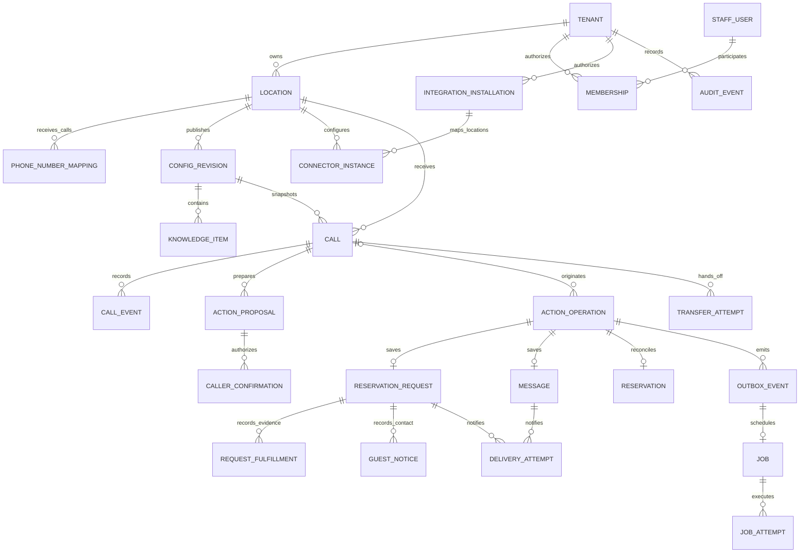

# Proposed data model and transactional contracts

Implementation evidence: see [current prototype status](IMPLEMENTATION_STATUS.md) and [ADR-009](adr/009-local-prototype.md). The requirements below include later pilot and production work; they are not all implemented.

Status: proposed logical schema; no migrations or database have been created. Use PostgreSQL as the authoritative store for business state, policy revisions, action outcomes, and durable work. API schemas, migrations, indexes, and retention settings must be implemented and reviewed before use.

Read alongside [architecture](ARCHITECTURE.md), [security](SECURITY.md), [integration contracts](INTEGRATIONS.md), [operations](OPERATIONS.md), and [testing](TESTING.md).

## 1. Ownership and relationships

A tenant is a business. A location belongs to exactly one tenant. A caller is an unverified person participating in a call, not an authenticated staff identity and not automatically a customer account. The initial pilot stores caller contact details in the specific request/message rather than building a searchable identity graph.

The diagram omits security/retention helpers and selected optional foreign keys. Every relationship between tenant-owned tables must enforce the matching `tenant_id` and, where applicable, `location_id`; a valid UUID is not proof of ownership.

## 2. Shared schema conventions

- Use opaque UUID primary keys; random identifiers supplement authorization, never replace it. Each tenant-owned table carries `tenant_id NOT NULL`; location-bound rows also carry `location_id NOT NULL`.
- Add unique composite keys such as `(tenant_id, id)` and `(tenant_id, location_id, id)` to support composite foreign keys. Store a location ownership constraint that ties `(tenant_id, location_id)` to `locations`.
- Use `timestamptz` for instants, UTC in application serialization, and an explicit IANA timezone for location calendar interpretation. Never use the deployment host timezone.
- Use integer versions for mutable records and expected-version conditions for staff edits. An immutable configuration revision is replaced by another revision rather than edited after publication. Bind sessions, call/media grants, leases, confirmations, and approvals to the current independently maintained authentication/recovery epoch; a database restore cannot resurrect authority from an older epoch.
- Validate status transitions in domain services and constrained transactional writes; enums/check constraints restrict legal values. JSONB stores schema-versioned bounded vendor metadata or approved structured content, not an unvalidated replacement for typed columns.
- Enforce practical length and quantity limits. Store money, if menu pricing is represented, as integer minor units with ISO currency, never floating point. Do not store payment card data.
- Do not embed secrets in tenant data, job payloads, or audit events. Persist secrets-store references and key versions; redact vendor raw payloads before storing.
- Encrypt transport and storage. Apply application-level envelope encryption to callback/contact data where the chosen key and query design permits it; normalize/search only fields justified by the pilot. Log neither plaintext contacts nor encryption keys.
- Enable and force PostgreSQL RLS where needed, with restricted application roles and transaction-local authenticated tenant context. Policies cover visibility (`USING`) and inserts/updates (`WITH CHECK`). Use separate narrowly controlled roles/functions for provider number resolution and dispatcher discovery; they return bounded tenant/mapping/job references without caller content. Pin the `search_path` and restrict `EXECUTE` for security-definer functions. Ordinary API/worker roles neither own tenant tables nor have `BYPASSRLS`; migration and backup roles are unavailable to application runtime.

## 3. Tenant, staff, configuration, and integration tables

| Table                        | Core fields                                                                                                                                                | Constraints and behavior                                                                                                                                              |
| ---------------------------- | ---------------------------------------------------------------------------------------------------------------------------------------------------------- | --------------------------------------------------------------------------------------------------------------------------------------------------------------------- |
| `tenants`                    | `id`, display name, `status`, revocation epoch, authorization revalidation/recovery epoch, plan/quota policy, timestamps                                   | Suspension blocks new sessions/actions; preserve already-started external outcome reconciliation. Recovered status is inactive until independently revalidated.       |
| `locations`                  | `tenant_id`, `id`, name, IANA timezone, status, published revision ID, revocation epoch                                                                    | Published revision belongs to this location. Timezone changes do not reinterpret stored requests.                                                                     |
| `staff_users`                | Internal ID, OIDC issuer and subject, active state                                                                                                         | Unique `(issuer, subject)`; do not identify a staff user only by mutable email. Global identity lookup is restricted; tenant data uses membership checks.             |
| `memberships`                | `tenant_id`, user ID, role, state, version, recovery epoch/current-authority revalidation evidence                                                         | Unique active user/tenant membership; role changes and revocation checked on each request. Restored memberships cannot authorize their own reapproval.                |
| `membership_location_scopes` | `tenant_id`, membership ID, `location_id`                                                                                                                  | Explicit assigned locations or documented tenant-wide role; no implicit scope from submitted IDs.                                                                     |
| `phone_number_mappings`      | `tenant_id`, `location_id`, provider/account/environment identifiers, canonical dedicated number, effective interval, state                                | Unique active provider/account/environment/number mapping; historical assignments retained. Only validated webhook account/number/environment can resolve a call.     |
| `config_revisions`           | `tenant_id`, `location_id`, revision number, schema version, structured hours/rules/greeting/disclosure, approval identity/time, effective time, digest    | Published content immutable. Drafts use version checks; publication validates the entire location configuration.                                                      |
| `knowledge_items`            | `tenant_id`, `location_id`, revision ID, fact/category, structured or bounded text content, source metadata, review/expiry time                            | Approved and effective content only; conflicting/expired facts cannot silently win. A later invalidation can supersede pinned facts.                                  |
| `knowledge_invalidations`    | `tenant_id`, `location_id`, revision/item or category scope, reason, actor/time                                                                            | Current checks reject revoked facts; do not rewrite historical revision content.                                                                                      |
| `transfer_destinations`      | `tenant_id`, `location_id`, ID, label, encrypted number, allowed hours/rules, status, revocation version                                                   | Allowed destination ID only; validate numbers/countries and loop prevention at publication and execution.                                                             |
| `integration_installations`  | `tenant_id`, provider/account/environment identifiers, authorized scopes, credential reference, authorizing administrator/evidence, state, revocation time | Tenant/account authorization boundary. No real credential material; scope or restaurant access is never assumed transferable.                                         |
| `connector_instances`        | `tenant_id`, `location_id`, installation ID, kind, vendor restaurant identifier, state, capability revision, schema version                                | Explicit installation/location mapping; ownership matches installation and location. OpenTable/Resy remain unverified/disabled until official access evidence exists. |
| `connector_capabilities`     | `tenant_id`, instance ID, operation, supported/enabled states, evidence/version, verification time, limits                                                 | Enabled requires verified support and authorized restaurant scope. Publication and runtime both check it.                                                             |

Prevent overlapping effective phone mappings and configuration publication races with a transaction and appropriate unique/exclusion constraints or locked ownership record. A number reassignment cannot move an existing call to another tenant.

Hours are structured local recurring intervals plus dated exceptions, including closed dates and overnight intervals. Menu/FAQ information and request policy belong to a configuration revision. Limit free-text prompts and preserve safe system policy outside editable restaurant content.

## 4. Calls, events, and media ownership

| Table                | Core fields                                                                                                                                                                                                                    | Constraints and behavior                                                                                                                                                                  |
| -------------------- | ------------------------------------------------------------------------------------------------------------------------------------------------------------------------------------------------------------------------------ | ----------------------------------------------------------------------------------------------------------------------------------------------------------------------------------------- |
| `calls`              | `tenant_id`, `location_id`, provider/account/environment/call identifiers, mapping ID, config revision ID, state, generation, lease owner/token/expiry, start/end instants, consent/disclosure flags, outcome, retention class | Unique provider/account/environment/call identifier. One logical call; states cannot reopen after terminal end. Callers' supplied names/IDs never establish tenant ownership.             |
| `call_events`        | Tenant/location/call IDs, event source/type, stable provider event key, environment, event time, receipt time, payload schema version, minimal validated metadata                                                              | Unique event source/account/environment/key. Processing order can differ from provider event order. Exclude audio and unnecessary raw content.                                            |
| `stream_grants`      | Tenant/location/call IDs, hashed token, generation, audience/account binding, expiry, redeemed/revoked time                                                                                                                    | Short-lived and one-use where provider capabilities allow; raw token never logged. Redemption and controller claim are atomic.                                                            |
| `conversation_turns` | Tenant/location/call IDs, generation, turn ID/order, turn kind, linked proposal ID, canonical readback digest, playback complete/invalidated flags, minimal recognition evidence                                               | Server-authored readback must complete before agreement is eligible. Track linkage without retaining speech text; interrupted or model-authored unrelated turns cannot confirm an action. |
| `call_transcripts`   | Tenant/location/call IDs, consent/policy reference, encrypted text/segments, retention expiry, schema version                                                                                                                  | Optional, off unless an approved policy explicitly enables retention. Access audited; default call summaries are a separate minimal record.                                               |
| `call_artifacts`     | Tenant/location/call IDs, artifact type, object-store key, policy/consent reference, expiry, deletion state                                                                                                                    | Future recording support only; raw recording off by default. Store object references, not public URLs.                                                                                    |

Proposed call lifecycle: `initializing -> active -> transferring -> staff_connected -> ended`; approved failed/unanswered transfer paths may return `transferring -> active`. Transport failures can enter `recovering` under a bounded resume policy. Terminal `ended` or `failed` cannot be undone by late events.

Claim or renew a call lease using a generation and lease-token comparison. A newer owner increments the generation; all internal action requests must match it. Use the database clock for lease comparisons. A lease is local coordination, not proof that a vendor operation did or did not execute.

Only concise approved context needed for operations is stored as a call summary. Treat summaries as personal data with their own short retention policy; “recording off” does not authorize indefinite summaries or transcript text in logs.

## 5. Proposals, confirmations, and action operations

| Table                        | Core fields                                                                                                                                                                                                                                                                                                                                                                                                                                                               | Constraints and behavior                                                                                                                                                                                                                                                                                                                               |
| ---------------------------- | ------------------------------------------------------------------------------------------------------------------------------------------------------------------------------------------------------------------------------------------------------------------------------------------------------------------------------------------------------------------------------------------------------------------------------------------------------------------------- | ------------------------------------------------------------------------------------------------------------------------------------------------------------------------------------------------------------------------------------------------------------------------------------------------------------------------------------------------------ |
| `action_proposals`           | Tenant/location/call IDs, kind, generation, canonical schema version, encrypted/minimized canonical payload, digest, rule/config revision, temporal reference timestamp/utterance ID for relative dates, proposed `execute_before` for future live bookings, readback turn, state, expiry                                                                                                                                                                                 | An edit creates a new proposal/digest and invalidates prior pending confirmation. Relative dates use the relevant utterance's recorded reference time; later execution never rebases them. The approved digest includes the execution deadline before token consumption; the worker cannot derive a later deadline. No model-provided tenant override. |
| `caller_confirmations`       | Tenant/location/call/proposal IDs, proposal digest, action kind, generation, agreement turn ID, issued/expiry time, state, consumed operation ID                                                                                                                                                                                                                                                                                                                          | One-use, same proposal and call; cannot be used for another action. Confirmation is not identity verification.                                                                                                                                                                                                                                         |
| `staff_action_approvals`     | Tenant/location IDs, staff actor, request/proposal reference, exact intent digest, permitted action, issued/expiry/consumed time, operation ID                                                                                                                                                                                                                                                                                                                            | Future connector-triggering staff approval; one-use and version-bound. Review claim is not approval to book. Caller agreement remains required for changed details.                                                                                                                                                                                    |
| `action_operations`          | Tenant/location IDs, origin kind, optional originating call ID, actor/service/staff reference, kind, proposal/confirmation or staff approval IDs, canonical payload digest, idempotency key, immutable `execute_before` for future live booking writes, deadline policy/offer/approval provenance, optional superseded operation ID, state, phase, version, connector instance/capability revision if needed, external correlation/reference, timestamps, safe error code | Unique scoped idempotency key; conflicting payload reuse fails. Live booking writes require a persisted execution deadline bound to approval; retries cannot extend it. Origin requires valid call or scoped staff actor. Preserve operation history even if call ended. Manual staff fulfillment records an operation before leaving the dashboard.   |
| `operation_attempts`         | Tenant/location/operation IDs, attempt number, lease token, dispatch-start time, result time, classification, sanitized response evidence, external idempotency/reference                                                                                                                                                                                                                                                                                                 | Record `dispatch_started` before external mutation. Crash after that point is uncertain unless proven otherwise.                                                                                                                                                                                                                                       |
| `operation_events`           | Tenant/location/operation IDs, from/to state, actor/service, reason, evidence reference, timestamp                                                                                                                                                                                                                                                                                                                                                                        | Append-only transition audit with minimized personal data.                                                                                                                                                                                                                                                                                             |
| `caller_verification_grants` | Tenant/location/call IDs, verification method, subject/reference, permitted actions, expiry, revocation time                                                                                                                                                                                                                                                                                                                                                              | Reserved for future sensitive lookup/change flows; absent in pilot. Scoped independent authentication is required before enabling these flows.                                                                                                                                                                                                         |

Request and message actions succeed synchronously once persisted and are immediately available in the authenticated dashboard inbox. Outbox/internal events are asynchronous; optional future external delivery is separate. Future external reservation mutations use ledger states `PENDING`, `EXECUTING`, `CANCELLED_BEFORE_DISPATCH`, `EXPIRED_BEFORE_DISPATCH`, `SUCCEEDED`, `FAILED`, `UNKNOWN`, `RECONCILING`, `MANUAL_REVIEW`, or `BLOCKED`. Adapter result `CONFIRMED` maps to ledger `SUCCEEDED` only with verified authoritative evidence. Unknown external writes are never reset to ordinary pending work merely because a lease expires.

The API stores an action receipt with its exact durable outcome. A request-only receipt is `PENDING_STAFF_REVIEW` with `tableConfirmed: false`; server-authored caller status wording uses that distinction. Retrying a completed request returns its original receipt without consuming a second confirmation. New caller execution after call disconnection is rejected; retrieval of a prior receipt is allowed to the scoped service. A committed future operation may continue in the worker under the authorization captured, currently permitted policy, and its original unexpired `execute_before` deadline. Separate later staff actions require active staff authority.

Enforce confirmation consumption and operation creation in one transaction. Use a unique operation relation on confirmation and a guarded update from `unused` to `consumed`; only one racing caller action can win. Delete or revoke confirmation tokens on expiry/call end while retaining a non-sensitive audit of consumed approval according to policy.

Explicit current-call cancellation of a future `PENDING` vendor operation uses the same row/version compare-and-set as first dispatch admission. Verify the current active call generation and operation ownership. A winning cancellation atomically sets `CANCELLED_BEFORE_DISPATCH` and prevents queued dispatch. A winning admission changes to `EXECUTING` with an admission phase; further cancellation cannot claim no side effect or trigger an automatic vendor cancel. Admission rechecks current authorization and revocation. Draft abandonment and staff changes to saved request records are separate workflows; disconnect alone does not cancel committed operations.

For future live bookings, `execute_before` is the earliest applicable caller-approved latest start, verified offer expiry, and restaurant maximum-wait policy. Persist its provenance with approval and retain it across every job attempt. Require database time `< execute_before` in the atomic first admission transition, then recheck immediately before network send after any journal/rate-limit wait. Expiry at either check can produce terminal `EXPIRED_BEFORE_DISPATCH` only with current ownership and reliable evidence that no attempt was sent; admission phase must remain distinguishable from possible dispatch. A crash or ambiguous send stays `UNKNOWN`/reconciliation regardless of the deadline. An expired, proven-unsent action stays terminal; fresh agreement creates a new linked operation instead of extending or reusing the old approval. Request-only inbox retention/follow-up and already-attempted-write reconciliation use their separate policies.

## 6. Restaurant request, reservation, message, and handoff records

| Table                  | Core fields                                                                                                                                                                                                                                                                                                                             | Constraints and behavior                                                                                                                                                                                        |
| ---------------------- | --------------------------------------------------------------------------------------------------------------------------------------------------------------------------------------------------------------------------------------------------------------------------------------------------------------------------------------- | --------------------------------------------------------------------------------------------------------------------------------------------------------------------------------------------------------------- |
| `reservation_requests` | Tenant/location/call/submission operation IDs, local date/time, timezone, resolved requested instant, offset, party size, encrypted name/contact, bounded seating note, workflow state, acknowledged actor/time, review lease actor/token/expiry, active fulfillment operation ID, booking evidence source, guest-notice state, version | Request-only submission; no inventory promise. Unique submission operation ID prevents retries creating another inbox item. Fulfillment lease expiry never releases an uncertain booking for repetition.        |
| `request_fulfillments` | Tenant/location/request/operation IDs, actor, state, started/completed times, final date/time/zone/party size, booking evidence source/reference or permitted minimal manual note, decline reason, changed-details agreement evidence, reconciliation evidence                                                                          | Staff-reported evidence is distinct from provider verification. One active or unresolved fulfillment per request; record before staff perform a write outside the dashboard.                                    |
| `guest_notices`        | Tenant/location/request IDs, staff actor, notice state, channel, attempted/recorded communication time, evidence type/reference                                                                                                                                                                                                         | `PENDING`, `ATTEMPTED`, or `COMMUNICATION_RECORDED` with provenance. Staff-reported contact is not proof of delivery; booking/inbox acknowledgement never implies notice.                                       |
| `reservations`         | Tenant/location/call/operation IDs, connector instance, vendor reservation ID/reference, authoritative state, confirmed details, last verified time, minimal customer reference                                                                                                                                                         | Future authorized integration only. Unique tenant/connector/vendor ID. Create only from verified authoritative success/reconciliation evidence.                                                                 |
| `messages`             | Tenant/location/call/operation IDs, encrypted caller name/contact and message, preferred callback window/timezone, staff assignment/disposition, version                                                                                                                                                                                | Unique operation ID; delivery does not mean read or callback completed. No unsupported callback promise.                                                                                                        |
| `delivery_attempts`    | Tenant/location IDs, request ID or message ID, channel/destination reference, stable delivery key, attempt state, acknowledgements, error classification, times                                                                                                                                                                         | Future external delivery only; no automatic email/SMS/Slack in pilot. Exactly one request/message source by check constraint; scope matches source. Acceptance, delivery, and human read are distinct evidence. |
| `transfer_attempts`    | Tenant/location/call IDs, operation ID, approved destination ID/revision, provider parent/leg reference, state, outcome evidence, summary reference, times                                                                                                                                                                              | One active transfer attempt per call; idempotent phone command when supported; unknown outcomes reconcile.                                                                                                      |

Canonical request workflow states are `PENDING_STAFF_REVIEW`, `ACKNOWLEDGED`, `IN_REVIEW`, `IN_FULFILLMENT`, `BOOKED_AWAITING_GUEST_NOTICE`, `DECLINED_AWAITING_GUEST_NOTICE`, `CLOSED`, and `NEEDS_RECONCILIATION`. They are independent of future external notification delivery states. Saving creates `PENDING_STAFF_REVIEW`; staff acknowledgement records receipt, and a versioned lease permits one staff reviewer.

Starting fulfillment creates a staff-owned operation/evidence record and transitions to `IN_FULFILLMENT` before any manual booking. Expiry before fulfillment can release review work; expiry/interruption after fulfillment becomes `NEEDS_RECONCILIATION`. A database constraint/domain guard allows only one active or unresolved fulfillment per request. Resolving this hold requires evidence from the existing reservation system; a fresh review claim cannot start another booking. PostgreSQL cannot prevent a staff member writing directly in a third-party website; the UI must expose the hold and the staff procedure must require reconciliation.

`BOOKED_AWAITING_GUEST_NOTICE` requires final booking details and evidence provenance (`STAFF_REPORTED` or future `PROVIDER_VERIFIED`), with separately recorded guest agreement for changes. `DECLINED_AWAITING_GUEST_NOTICE` requires a documented decline; a possible prior booking cannot be classified declined without reliable reconciliation. Closure follows the documented guest-notice policy. No staff checkbox, provider reference, or inbox acknowledgement automatically proves guest receipt.

After an unknown future external write, any inbox follow-up references the existing operation and enters `NEEDS_RECONCILIATION`; never create an independent actionable fallback request or unlinked manual fulfillment. Before dispatch, request-only fallback can be submitted after caller agreement. Distinguish failed dispatch before any side effect from uncertain dispatch using evidence, not an expired lease.

Future reservation states might include `confirmed`, `cancelled`, and `unknown` using normalized adapter evidence. Store only confirmed vendor facts; a pending operation should not fabricate a reservation row. Separate connector references from business-visible references and validate both.

Do not deduplicate legitimate repeated contact solely on callback number, name, date, or party size. Those are ambiguous. Within a call, stable operation identity plus outstanding intent checks prevent duplicate retries. Future vendor-write reconciliation needs a verified correlation strategy; contact similarity alone is insufficient proof.

## 7. Durable work, audit, retention, and deletion

| Table                       | Core fields                                                                                                                                         | Constraints and behavior                                                                                                                                                                                                                         |
| --------------------------- | --------------------------------------------------------------------------------------------------------------------------------------------------- | ------------------------------------------------------------------------------------------------------------------------------------------------------------------------------------------------------------------------------------------------ |
| `outbox_events`             | Tenant/location IDs, event ID, aggregate type/ID/version, event type, schema version, minimal payload, created/published time                       | Insert in the same transaction as the domain change. Unique event ID; no secrets or unnecessary PII.                                                                                                                                             |
| `jobs`                      | Tenant/location IDs, outbox event ID, kind, record ID/version, state, next-run time, attempt count/limit, lease owner/token/expiry, last safe error | Unique event/kind where one job is intended. Narrow dispatcher issues trusted job/tenant claim references; worker validates association then enters tenant scope. Claims/retries are bounded; classify external mutation uncertainty separately. |
| `job_attempts`              | Tenant/location/job IDs, attempt index, lease token, start/finish time, outcome, trace/correlation ID                                               | Current token required to complete work; stale executors cannot update a new attempt.                                                                                                                                                            |
| `audit_events`              | Tenant/location as applicable, actor type/ID, action, target type/ID, redacted change metadata, timestamp, correlation ID                           | Append-only to ordinary runtime roles. Record policy publication, access to sensitive records, role changes, integrations, transfers, deletion, and support access.                                                                              |
| `retention_policies`        | Tenant/location scope, data class, duration, policy version, legal/operating basis reference, approval                                              | Pilot launch requires explicit values; unspecified duration is not indefinite retention permission.                                                                                                                                              |
| `deletion_requests`         | Tenant scope, verified requester/reference, target classes, state, deadline, provider/local outcomes                                                | Track deletion across live DB, object store, processors, search indexes, and operational copies.                                                                                                                                                 |
| `deletion_tombstones`       | Scope and minimal target/operation identity, deletion time, expiry                                                                                  | Keep only minimal justified identifiers to prevent deleted content being recreated by replay; no deleted transcript/contact payload.                                                                                                             |
| `recovery_journal_index`    | Minimal journal event ID, tenant/location, operation or deletion reference, evidence kind, acknowledged time, external store pointer                | Optional local index of a separate restricted durable journal; PostgreSQL is not the only copy. Contains no contacts/audio/transcripts/credentials. Rebuildable after restore.                                                                   |
| `recovery_control_snapshot` | Current recovery/auth epoch, quarantine status, checkpoint/evidence references, scope revalidation markers                                          | Optional local read-through copy of independent control-plane state; not an authoritative epoch source within PostgreSQL backup history. Fail closed when current independent state cannot be established.                                       |

Do not erase audit/security evidence by cascading every parent deletion blindly. Design explicit retention/deletion for personal fields and dependent data. A tenant deletion must revoke access first, stop new work, settle or quarantine unknown side effects, remove retained personal data under policy, and record completion. Preserve only a justified minimal audit/tombstone after deletion.

Backup deletion is typically controlled by backup expiry rather than per-row edits. A PostgreSQL restore also rolls back local deletion tombstones and action receipts, so a journal outside that restore/rollback domain must preserve minimal deletion evidence and, before enabling future vendor writes, dispatch intents/outcomes. Store only scoped IDs, operation/idempotency/correlation references, canonical digest, event kind/time, and sanitized authoritative outcome/reference as necessary. This journal has encryption, narrowly scoped append/read identities, append durability acknowledgement, audit, and explicit retention/deletion policy; a tenant-scoped local index is not its authoritative source.

After first dispatch admission, append the intent and await durable acknowledgement **before** any external mutation. Failure to acknowledge blocks dispatch; missing/partial journal records on recovery cause a hold. After network execution, append the outcome as well as storing the operation result. This sequence is not a distributed transaction: an intent may exist without a write, and an outcome may be missing after a successful vendor write. Neither proves failure. Reconciliation remains mandatory for ambiguous cases.

A restored database starts with jobs quarantined and external-write egress disabled. Replay restore-independent deletion evidence before exposing data; merge journalled operation identities/outcomes and reconcile every possibly dispatched write before redrive. A journal entry for a newer operation absent from the restored database requires a recovery record/hold rather than another create. Retain minimized deletion evidence through the oldest recoverable backup horizon and operation evidence through the documented provider replay/idempotency/reconciliation and restore horizons, whichever requires longer. Set actual horizons before activation; indefinite retention is not implied. Journal outage and restore tests are required. Processor deletion limitations need documented handling before using a provider.

A missing dispatch entry is never permission to send an old `PENDING` operation: post-backup cancellation or changed guest intent may also have been lost. Restored pre-dispatch writes remain blocked until fresh operation-specific approval after staff verify current guest intent; recheck current restaurant and connector permissions. Do not automatically redrive any restored external-write job on the basis of old approval.

Maintain a current recovery/auth epoch and checkpoint outside the primary database rollback domain. On restore, increment/replace that epoch and invalidate recovered browser sessions, stream grants, call/worker leases, unused caller confirmations, and staff approvals. Suspend tenant admission and capabilities. Recovered membership, tenant suspension, routing/number reassignment, staff destination allowlists, and connector revocation require trustworthy independent security-decision replay or explicit owner/provider reauthorization from verified current authority; restored membership/approval records cannot establish that authority themselves. Record revalidation evidence per scope and keep incomplete scopes closed. Fresh login is insufficient to reauthorize stale location/provider mappings. Cover security-decision records with their own minimized retention and access policy rather than treating contact-content journal entries as authorization.

## 8. Critical transactional invariants

| Operation                     | Required transaction and invariant                                                                                                                                                                                                                                                                                                                              |
| ----------------------------- | --------------------------------------------------------------------------------------------------------------------------------------------------------------------------------------------------------------------------------------------------------------------------------------------------------------------------------------------------------------- |
| Create inbound call           | Deduplicate authenticated provider identity, lock/resolve active number mapping, assign tenant/location and immutable revision, create call/grant. A replay cannot allocate another call.                                                                                                                                                                       |
| Claim/resume media            | Atomically redeem valid grant and claim/increment generation; expired/revoked grants or stale owners fail.                                                                                                                                                                                                                                                      |
| Publish config                | Validate schema/references, check expected draft version, record approval, update current revision atomically; current action policy/revocation is separately readable.                                                                                                                                                                                         |
| Submit request/message        | Validate active current generation, current policy, same canonical proposal/confirmation, stable idempotency, consume confirmation, insert action + inbox business record + outbox together. Inbox visibility does not wait for a worker.                                                                                                                       |
| Duplicate action retry        | Return original receipt when payload digest matches; reject conflicts. Retries never produce another business record or outbox event.                                                                                                                                                                                                                           |
| Discover/claim job            | Narrow dispatcher discovers bounded job/tenant references without caller content. Validate trusted association before ordinary worker sets tenant scope; short locked claim assigns lease token/expiry. No network calls while claim transaction is open.                                                                                                       |
| Start vendor mutation         | Atomically require database time `< execute_before` with first admission and current capability/revocation checks; record dispatch-start evidence and stable vendor idempotency/correlation key before network call. Recheck the deadline immediately before send after any intervening wait.                                                                   |
| Expire an unsent booking      | Current owner/version plus proven no dispatch; set `EXPIRED_BEFORE_DISPATCH` atomically and make queued work ineligible. Never convert sent/uncertain work to this state; new booking needs fresh agreement and a new linked operation.                                                                                                                         |
| Cancel before dispatch        | Same active call/current generation; cancellation `PENDING -> CANCELLED_BEFORE_DISPATCH` races atomically against first dispatch admission. If cancellation wins, no external write; if admission wins, no claim of cancellation or automatic vendor cancel.                                                                                                    |
| Journal before external write | After admission, await durable restore-independent intent acknowledgement before sending. Missing/partial journal or restored jobs remain held; outcome journalling does not replace authoritative reconciliation.                                                                                                                                              |
| Finish vendor mutation        | Verify current operation state/token, persist authoritative outcome and reference, append event, enqueue resulting notifications atomically. Unknown results remain explicit.                                                                                                                                                                                   |
| Reconcile uncertain write     | Use verified lookup/idempotency evidence. Reliable success may create reservation record; unreliable/absent evidence goes to manual review, not a blind retry.                                                                                                                                                                                                  |
| Staff update                  | Verify current role/location and expected record version; commit disposition plus audit event. Concurrent reviewers do not silently overwrite one another.                                                                                                                                                                                                      |
| Start staff fulfillment       | Current staff permission plus review lease/version; create operation/evidence record and atomically enter `IN_FULFILLMENT`. One active/unresolved fulfillment; lease expiry after this cannot permit another write.                                                                                                                                             |
| Resolve staff uncertainty     | Check existing reservation system, record booking/no-booking evidence and actor, update existing operation/hold; require guest agreement for changed final details and track notice separately.                                                                                                                                                                 |
| Disconnect                    | End call monotonically, invalidate unused confirmation and stream/controller authority; do not delete committed operations or stop necessary reconciliation.                                                                                                                                                                                                    |
| Restore                       | New independent recovery/auth epoch invalidates sessions/grants/leases/approvals; quarantine routing/jobs/egress. Replay deletion and security decisions or reauthorize scopes from verified current authority, recover newer operations, reconcile possibly dispatched writes, and require fresh approval/current guest intent for pre-restore pending writes. |

Transaction isolation and row-lock strategy must be selected for each invariant and verified with concurrency tests. Prefer explicit row/version conditions over an assumption that a single process serializes all events. No transaction can atomically include an external vendor side effect; the ledger and reconciliation are required precisely for that gap.

## 9. Dates, times, and DST

Each location stores a valid IANA timezone, such as `America/New_York`, and displays caller/staff dates in that location's timezone unless explicitly agreed otherwise. Resolve relative language using the server-recorded start timestamp of the relevant caller utterance in that zone. Persist this UTC reference timestamp and utterance ID with the proposal; neither call start nor later parsing/worker execution supplies the reference date. Read back an exact local date and time, including year when ambiguous. If a caller revises a relative date, capture the new utterance's reference and obtain a new confirmation; simply replaying a proposal later must not change its date.

Store the original confirmed local date/time, timezone, resolved UTC instant, offset, temporal reference timestamp/utterance ID, and relevant configuration revision. Freeze these explicit confirmed values through queuing and retries, including across midnight; new current-time checks can reject a stale proposal but must not reinterpret its date. This preserves intent and prevents a later timezone edit from changing a request. For future vendors, also preserve their documented time representation and authoritative returned instant.

- A nonexistent local time during spring-forward is invalid: explain and request another time.
- A repeated local time during fall-back is ambiguous: ask which occurrence/offset when meaningful, or route to staff; do not silently choose one.
- Overnight hours span calendar dates and must be represented as intervals, not a naive `close > open` rule.
- Holiday exceptions take precedence over recurring hours. Closing/opening changes may invalidate a previously confirmed proposal before submission.
- A reservation request does not claim a slot exists. Future offers include freshness/expiry, and a new booking must accept possible conflict or vendor rejection.
- Validate party size, permitted booking/request horizon, minimum lead time, and operating policy using location time and an authoritative server clock. Test midnight, year rollover, DST, leap day, and callers outside the location timezone.

## 10. Indexes and query limits

Proposed indexes supplement primary/foreign/unique constraints:

- Staff queues: `(tenant_id, location_id, submission_state, created_at)` and staff disposition indexes appropriate to actual queries.
- Calls: `(tenant_id, location_id, started_at DESC)` plus provider account/call identity uniqueness.
- Operations: scoped idempotency uniqueness; `(tenant_id, location_id, state, updated_at)` for reconciliation/manual review.
- Jobs: partial index on eligible state and `next_run_at`, plus lease-expiry recovery index; worker query requires a bounded batch.
- Outbox: partial unpublished index ordered by creation time; unique downstream materialization keys.
- Retention: indexes on expiry/deletion state for bounded cleanup batches.
- Membership: identity/tenant and location-scope indexes for each authorization request.

Paginate staff APIs with bounded cursor queries and server-enforced page sizes; do not return all tenant calls/transcripts. Verify query plans under realistic pilot volume before adding broad JSONB or text indexes. Text/semantic search requires its own tenant and deletion guarantees.

## 11. Schema implementation gates

Before real calls, migrations and meaningful tests must prove: cross-tenant foreign-key rejection and RLS denial, transaction-local tenant isolation under pool reuse, duplicate webhook/action handling, one-time confirmation consumption, controller fencing, atomic outbox, worker crash recovery, unknown external result handling, staff concurrency, temporal validation, and retention/deletion behavior. Follow [the test strategy](TESTING.md).

Resolve these design details during the implementation milestones: exact provider event identity, stream authentication capabilities, OIDC membership mapping, contact encryption/key rotation, local transcript/summary retention periods, staff delivery evidence, verified vendor correlation methods, and backup/deletion procedures. Keep vendor-write tables and capabilities disabled until their corresponding integration gates pass.
