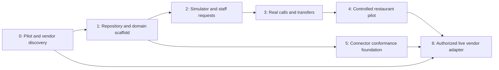

# Implementation plan

Status: proposed implementation plan, with documentation completed first. The accepted pilot uses staff-confirmed reservation requests. No application milestones below are complete merely because they are documented.

## Scope and success

The first restaurant can forward calls to a dedicated number, have its approved questions answered, receive reservation requests and messages in a staff inbox, and accept configured staff transfers. The agent discloses its role, handles interruption, and gives accurate action status. Staff remain responsible for checking table availability and confirming requests during the first release.

OpenTable and Resy support is designed into the domain and connector interfaces from the start. Each live adapter is a separate gated implementation after commercial/technical access is established; neither vendor is required to launch request collection. Avoid coupling the restaurant model to a particular reservation vendor.

First release boundaries: one location per pilot tenant, one language, no payments or orders, no automatic reservation changes or sensitive customer lookup, no voiceprints, no synthetic-voice fraud decisions. Domain ownership and location-scoped configuration still support later expansion. Do not mistake location support for a delivered multi-location product.

## Milestone dependencies

M5's interfaces and disabled provider registrations begin in M1; its full conformance scenarios build on M2. M6 may remain blocked on vendor access without blocking M4. Sequence gates by evidence rather than a speculative delivery date.

## 0. Pilot and provider discovery

Deliverables:

- Confirm one pilot restaurant, its region/timezone, staff contact process, menu source, holiday hours, reservation and transfer rules, and how staff will confirm guests.
- Select phone and realtime voice vendors, external OIDC identity provider, production host/region, and managed PostgreSQL. Verify persistent WebSocket support, telephony transfer lifecycle, signed inbound callbacks/media binding, concurrency limits, provider outage fallback, retention controls, and price inputs from current official documentation and account capabilities.
- Test forwarding semantics with the restaurant's carrier, caller-ID preservation, dialed-number tenant selection, whether original-call details survive, and transfer-loop prevention. Allocate a dedicated test number before routing customers.
- Determine whether the pilot has OpenTable or Resy and can authorize an official integration. Record capability evidence and access requirements; do not assume public booking or reservation-management API availability.
- Approve greeting/AI disclosure, recording policy, transcript retention, data regions, subprocessors, guest contact handling, and caller verification boundaries for the operating region.

Exit gate: restaurant configuration and approved knowledge exist; provider-selection decisions and unresolved limits are recorded; the pilot can launch with requests even if reservation API access is unavailable. Funding/account access and commercial/legal decisions remain owner dependencies, not assumptions for an agent to invent.

## 1. Repository, infrastructure definitions, and domain scaffold

Deliverables:

- Pin a supported Node.js LTS and pnpm version; add a lockfile, strict TypeScript, formatting/linting, runtime schema validation, workspace scripts, and local setup instructions.
- Create apps/dashboard, apps/api, apps/voice-gateway, apps/worker and packages/domain, packages/contracts, packages/connectors, packages/config, packages/observability. Dependency direction follows [engineering standards](ENGINEERING.md).
- Implement staff OIDC sessions, tenant membership/RBAC, onboarding states, tenant-scoped repository boundaries, PostgreSQL row-level isolation, migrations, and synthetic fixture data.
- Implement configuration revisions, location/timezone models, calls, caller confirmation records, requests, messages, audit events, connector registrations/capabilities, and durable outbox/leased jobs.
- Define deployments, private database networking, TLS, secret references, health/readiness, graceful draining, logs/metrics, backups, and preview/staging separation as reviewable infrastructure code. Provisioning production is a later explicitly authorized action.
- Add request-only and deterministic fake connector interfaces, disabled OpenTable/Resy registrations, feature flags, kill switches, and capability probes that cannot silently enable writes.
- Establish CI checks and private vulnerability reporting; verify actual repository settings rather than describing them as enabled.

Exit gate: reproducible synthetic local environment; tenant-crossing tests fail closed for API, worker, repositories, and exported records; migrations work from an empty database; no provider secrets required to run the default development workflow.

## 2. Conversation simulator and staff fulfillment

Deliverables:

- Simulate calls through the same domain/action service used by live audio. Use deterministic fixtures and distinguish scripted conversation tests from evaluations of a real model.
- Implement approved hours/menu/FAQ answers, ambiguity clarification, date/time resolution, bounded escalation, message capture, and exact reservation-request readback.
- Bind caller confirmation to the final structured payload, call, tenant/location, and expiry. Invalidate it when details change. Prevent caller-controlled tenant IDs or permissions.
- Persist one request and its outbox event atomically; handle repeats and disconnects without losing or duplicating the request. Report saved request status only after commit.
- Build a staff inbox with authenticated access, claim/assignment and optimistic concurrency, status updates, audit history, and callback details. Staff confirm in their existing system, record a reference/evidence, and record guest-notification status separately.
- Deliver first through the dashboard, where inbox availability and staff acknowledgment are separate states. Any later SMS/email delivery needs an authorized restaurant configuration and its own provider verification, privacy rules, retries, and consent checks.

Exit gate: representative FAQ/request/message/handoff scenarios pass, unsupported allergy and availability claims are escalated, concurrency tests permit one platform fulfillment owner and preserve reconciliation holds after interruptions, request delivery is not represented as booking confirmation, and synthetic tenant isolation is verified. Staff procedures and evidence must cover direct bookings made outside the platform, which the dashboard cannot technically prevent.

## 3. Real phone calls and human handoff

Deliverables:

- Implement the selected phone adapter, validated callbacks, provider-call-to-tenant mapping, single active media session ownership, authenticated media setup, and realtime voice adapter.
- Handle interruptions, silence, audio buffering/backpressure, provider latency, session expiry, and clean shutdown. Stop or cancel stale agent speech when interrupted; cancel obsolete reads without losing durable action outcomes.
- Implement caller-requested and policy-required transfers, allowlisted destinations, actual answered/failed/busy/no-answer outcomes, finite retry rules, and message fallback. A transfer initiation is not a completed staff connection.
- Provide staff context through the dashboard and a provider-supported warm handoff where verified. Keep private notes out of audio played to callers or voicemail.
- Add approved after-hours behavior, call/session budgets, per-tenant limits, configured fallback routing, and operator kill switches.

Exit gate: real test calls demonstrate audio quality and usable response times, interruption behavior, successful and unanswered transfers, signature/replay protections, reconnect races, outage fallback, and accurate request outcomes after disconnects. Verify that no call transfer loops back into the AI number.

## 4. Controlled pilot and operational readiness

Deliverables:

- Deploy to isolated staging first; use approved restaurant configuration and a dedicated pilot number with synthetic calls. Enable restaurant forwarding only when pilot readiness is accepted.
- Tune response latency and reliability using measured percentiles. Evaluate accents/noise and clarification behavior with consented or synthetic inputs; report subgroup/sample limits instead of claiming universal accuracy.
- Exercise incidents, backup restoration, connector disablement, queue failure, expired credentials, tenant offboarding, deletion, and config rollback. Verify product status wording against each failure state.
- Implement and test restricted recovery evidence outside PostgreSQL restore history for deletion and security/control-plane decisions, with explicit current-authority reauthorization if historical security coverage is unavailable. Restore stays quarantined; invalidate recovered sessions/grants/leases and reconstruct current permissions, routing and revocation before reopening. Future live writes also require externally durable dispatch-intent/outcome evidence before dispatch; pre-restore queued writes need fresh approval, so older restored jobs cannot resurrect canceled or duplicate bookings.
- Establish an owner for the staff inbox and stale-request escalation. Agree business-hours acknowledgment goals and realistic callback expectations.
- Track accurate answers, correctly saved requests, staff corrections, completed transfers, message acknowledgments, abandonment, latency, and cost per call.

Exit gate: [testing](TESTING.md), [security](SECURITY.md), and [operations](OPERATIONS.md) release gates have recorded evidence; remaining risk owners accept the documented pilot limits. Expand only after reviewing actual outcomes.

## 5. Shared live-reservation connector foundation

Deliverables:

- Version domain contracts for capabilities, availability, reservation holds if supported, create/status reconciliation, normalized outcomes, credentials, location mapping, webhooks, and provider-specific extensions.
- Implement shared request validation, live permission checks, idempotency, action ledger, confirmation binding, write fencing, timeout policy, circuit breakers, rate budgets, audit events, and reconciliation jobs.
- Define atomic cancellation of a pending confirmed action versus first dispatch admission. Disconnect alone does not withdraw a committed action; an already dispatched action cannot be reported as canceled without authoritative evidence. Journal dispatch intents before sending and preserve recovery holds when outcomes cannot be reconstructed.
- Build a conformance suite with deterministic fake responses: conflict, rate limiting, auth expiry, unsupported operation, accepted-then-timeout, webhook ordering, replay, and cross-tenant provider location mismatch.
- Keep Resy/OpenTable adapters disabled with explicit unavailable states. Mock results are labeled synthetic and never selectable for a production call. Expose only reviewed capabilities to the agent.

Exit gate: no future adapter can bypass the action service, treat an unknown write as failure/success, or retry unsafely. Fallback request collection before an attempted booking needs a truthful explanation and caller agreement; an unresolved attempted write goes to reconciliation rather than a second booking path.

## 6. Authorized OpenTable or Resy integration, independently

Deliverables for each vendor:

- Record official access approval, restaurant/location authorization, applicable terms/scopes, supported API version/operations, sandbox, signing/authentication behavior, rate limits, and credential rotation/revocation procedure.
- Implement only verified operations and run the same connector conformance suite plus sandbox integration tests. Verify capacity remains vendor-authoritative and restaurant mapping is exact.
- Prove accepted-then-timeout reconciliation. If the vendor cannot safely resolve an ambiguous write, block automatic retry and require staff resolution; reduce supported capability accordingly.
- Enable one restaurant through a reversible feature flag, monitor outcome integrity, and document rollback/reconciliation with staff. Add lookup/change/cancel only with separate verified capabilities and appropriate caller verification.

Exit gate: restaurant-authorized sandbox evidence, correct confirmed reservation references, no duplicates in failure/replay tests, revocation behavior, tested unknown-outcome recovery, and restaurant approval for the enabled workflow. OpenTable and Resy progress separately; completion of one says nothing about access to the other.

## Work ownership and definition of done

Use small vertical slices with explicit file ownership for parallel agents. Architecture/domain changes need interface agreement before parallel implementation. A feature is done when behavior is implemented, appropriate checks pass, failure and security paths are reviewed, relevant docs are updated, and operational handling is defined. A mock, placeholder, or undocumented vendor assumption never satisfies a live integration gate.

Each issue should state trigger/result, scope, dependencies, data involved, acceptance scenarios, security implications, and evidence needed. Each PR follows [CONTRIBUTING.md](../CONTRIBUTING.md) and the [PR template](../.github/pull_request_template.md). Agents follow [AGENTS.md](../AGENTS.md). Command names become executable only when scaffold scripts exist; until then validate documentation and report application tests as unavailable.

## Open decisions and dependencies

| Dependency | Owner role | Resolution milestone |
| --- | --- | --- |
| Pilot restaurant, jurisdiction, timezone, staff response process | Product owner and restaurant manager | 0 |
| Phone/voice capabilities, accounts, costs and limits | Technical lead and product owner | 0–3 |
| OIDC, production host/region, database and secrets service | Technical lead | 0–1 |
| Recording/disclosure, retention and vendor data terms | Product owner with appropriate privacy/legal advice | 0, before real caller data |
| Authorized OpenTable/Resy API access and permitted operations | Product owner, restaurant and vendor | 0/6 |
| Production branch protections and private security reporting | Repository owner | 1 |
| Staff notification channel beyond dashboard | Restaurant manager and technical lead | Later optional slice |
| Voiceprint or synthetic-voice processing | Separate future product/security review | Outside first release |
