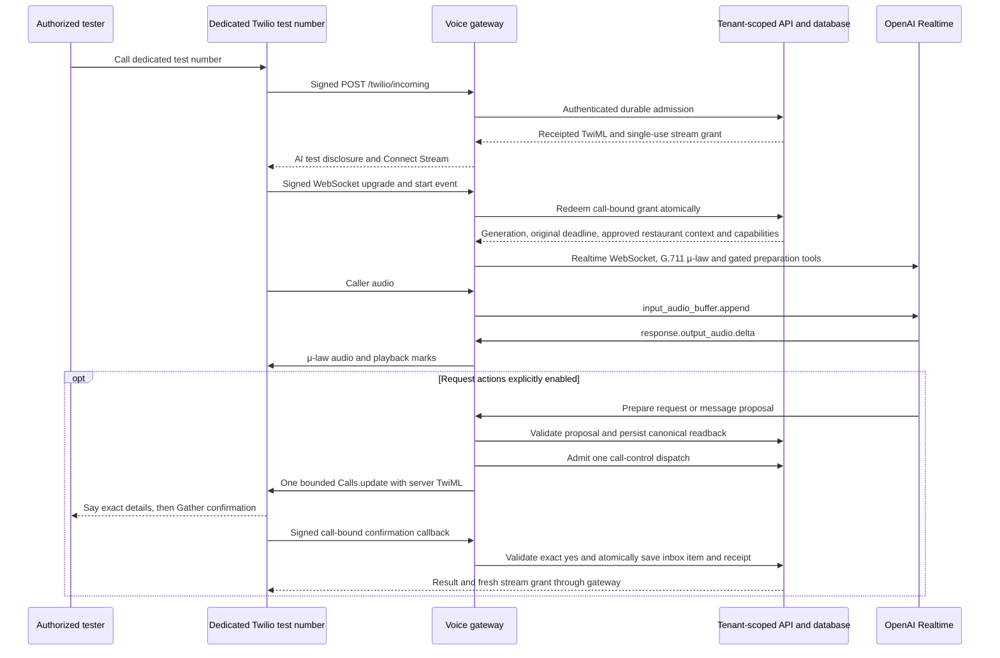

# Telephone voice sandbox

Hostline has an executable, disabled-by-default Twilio Media Streams ↔ OpenAI Realtime gateway. Its authoritative call admission, stream grants, callback receipts, proposal confirmation, and control state now live in the tenant-scoped database. Optional test flags allow saving reservation **requests** or messages to the staff inbox after a server-controlled readback and explicit spoken confirmation, and allow a configured staff transfer. A saved request does not reserve a table, notify staff externally, or verify the caller's identity.

The implementation and deterministic tests are local evidence. No provider account was changed, number purchased, customer called, forwarding configured, or paid voice/model request made as part of these tests. Production startup remains blocked. Dedicated-number acceptance tests are still required before any customer calls.

At most one reservation request or message can be saved per phone call. FAQs and a configured transfer can continue afterward; multiple saved items in one call are outside this foundation.

“Sandbox” here means Hostline's isolated application test mode. It does not mean the Twilio WhatsApp Sandbox, and Twilio's REST test credentials do not provide a real incoming audio call. A real voice test requires an authorized dedicated voice number and its account credentials; trial-account restrictions and provider charges can still apply.

## How a test call reaches the AI

The restaurant can eventually keep its public number by forwarding its carrier to the dedicated Twilio number. Carrier forwarding, original caller ID, forwarding conditions, human escalation, outage routing, and rollback require separate verification. **For this release, call the dedicated test number directly; do not forward customer calls to the sandbox.**

## Configuration

Inject secrets through the environment secret store. The development entrypoints load an ignored `.env` file if present; injected environment variables take precedence. Do not paste secrets into chat, source, browser settings, screenshots, or command-line arguments. The API and gateway require matching server-side identity, tenant, public origin, and capability settings.

| Variable                     | Requirement / default                                                                                                                                           |
| ---------------------------- | --------------------------------------------------------------------------------------------------------------------------------------------------------------- |
| `LIVE_VOICE_ENABLED`         | `false` by default; set `true` only for an authorized isolated test.                                                                                            |
| `VOICE_MODE`                 | Must explicitly be `sandbox` when enabled.                                                                                                                      |
| `VOICE_ACTIONS_ENABLED`      | Exact `true` or `false`; defaults `false`. Enable on both API and gateway only to test confirmed request/message saving. It never enables live vendor bookings. |
| `VOICE_TRANSFERS_ENABLED`    | Exact `true` or `false`; defaults `false`. Enable on both API and gateway only after approving an independent staff destination.                                |
| `TWILIO_ACCOUNT_SID`         | Account owning the dedicated voice test number; verified callbacks and stream account must match.                                                               |
| `TWILIO_AUTH_TOKEN`          | Server-only Twilio callback signature validation and call-control credential.                                                                                   |
| `TWILIO_PHONE_NUMBER`        | Dedicated platform test number in E.164 format, e.g. `+12125550142` (synthetic example).                                                                        |
| `OPENAI_API_KEY`             | Server-only API key with authorized Realtime access and account spending controls.                                                                              |
| `VOICE_PUBLIC_URL`           | Exact public HTTPS gateway origin, without credentials, path, query, or fragment.                                                                               |
| `API_INTERNAL_URL`           | Defaults to `http://127.0.0.1:3001`; remote origins must use HTTPS.                                                                                             |
| `VOICE_SERVICE_TOKEN`        | At least 32 characters; matching scoped API credential. Never sent to Twilio or OpenAI.                                                                         |
| `VOICE_TENANT_ID`            | Configured tenant UUID on API and gateway. Model arguments and callback parameters cannot choose a tenant.                                                      |
| `VOICE_PORT`                 | `3002`, with `PORT` as fallback; listener binds to loopback.                                                                                                    |
| `OPENAI_REALTIME_MODEL`      | Defaults to `gpt-realtime`; `gpt-realtime-mini` also accepted. Verify access, quality, region, and price in the account.                                        |
| `VOICE_MAX_CONCURRENT_CALLS` | Defaults to `2`; supported range 1–10. Persistent API admission is authoritative.                                                                               |
| `VOICE_MAX_CALL_SECONDS`     | Defaults to `300`; supported range 15–600. Original persisted call deadline survives resumed streams.                                                           |

`NODE_ENV=production` rejects enabled voice. Removing that gate requires completing and reviewing the production controls, not relabeling an environment.

Run the API with internal voice identity configured, then `pnpm dev:voice`. With voice disabled, `/health` works and incoming calls return 503 without opening OpenAI. Health returns capability flags and production status, never secrets or phone numbers. Flags report configuration, not provider acceptance evidence.

Use an authorized TLS reverse proxy or development tunnel supporting long-lived WebSockets. Expose only the gateway; keep the internal API and demo dashboard private. The public HTTPS origin must exactly match `VOICE_PUBLIC_URL`; Host and forwarded headers never select signature-verification origins.

## Twilio setup to perform manually for a test

These steps prepare a dedicated test line; the scripts do not purchase numbers or change routing.

1. Select an existing dedicated **test** voice number owned by the configured account. Confirm trial restrictions, permission to use the line, and account spending controls.
2. Set incoming voice webhook to `https://<gateway-origin>/twilio/incoming`, method **POST**, with no query or trailing slash. Configure the call status callback as `https://<gateway-origin>/twilio/status`, **POST**, where supported by the number/account configuration.
3. Configure an independent provider-hosted failure route for an unreachable gateway. Trailing TwiML handles a stream ending while Twilio resumes instructions; it cannot serve an outage if this gateway is unreachable. No external failure route is provisioned by this repository.
4. Start with both action flags `false`. Call the dedicated number from an authorized tester's phone; verify the AI disclosure, correct restaurant facts, two-way audio, interruptions, hangup, and unavailable-action wording.
5. To test request saving, enable `VOICE_ACTIONS_ENABLED` on API and gateway and restart both. Use synthetic guest details. Hear the full deterministic readback, then say an unambiguous “yes.” Verify exactly one inbox item, the saved-request wording, correction/no-input behavior, replay handling, and stale-configuration rejection. A spoken yes is task confirmation, **not identity authentication**.
6. Before transfer tests, approve a separate staff number and verify it does not forward back to the AI. Restaurant `transferEnabled` and the test flag must both be enabled. The server rejects destinations equal to either the Twilio number or the restaurant's public forwarded number. Test human request, answer, busy, no-answer, failure, child-leg callbacks, original call budget, and reconnection.
7. After testing, disable/restart/drain the gateway and restore the dedicated number's routing as appropriate. Updating an environment variable alone does not alter a running process.

The server emits short-lived grants as Stream custom parameters, not URL query parameters. Incoming callbacks are verified with the official Twilio SDK against the exact configured HTTPS URL. Media upgrade signatures accept only the fixed configured WSS URL and its HTTPS equivalent. Verify actual Twilio/proxy behavior without adding a signature bypass.

## Enforced authorization and lifecycle

- The gateway checks SDK signatures over all parsed form fields, expected account and inbound called number, bounded body size, exact path, and identifier format. Confirmation paths contain 64-character opaque tokens. Child Number status callbacks use a different outbound leg and destination; they still require a valid account signature and the API's call-bound transfer nonce. They are not incorrectly treated as a new inbound call.
- The API persists callback receipts, call state, original deadline, generations, hashed grants, canonical proposals, and dispatch state. A grant is consumed atomically before any OpenAI connection. Replays and late terminal callbacks cannot reopen spent or ended calls, including after ordinary process restart. Terminal status arriving before the incoming callback creates an ended tombstone. This is not a database-restore recovery-epoch guarantee.
- Tenant identity comes from scoped service configuration and a restricted tenant transaction. The gateway validates internal response schemas, matching tenant IDs and restaurant scope, three-second deadlines, a 128 KiB limit, and no redirects. The provider host is fixed to `api.openai.com`.
- Tools only prepare a request/message or request an allowlisted transfer. No model tool saves, confirms, books, authenticates a caller, chooses a tenant, supplies a staff number, or returns a success receipt. Both API and gateway capabilities must allow the action.
- Relative dates use a server timestamp bound to the specific caller utterance containing the date expression. Validated VAD positions reference authenticated media already appended to the model. Server-issued opaque handles are retained across later name/phone utterances, so crossing midnight cannot silently re-anchor “tomorrow.” Unknown handles and model-supplied timestamps are rejected. Once read back, the server freezes the explicit date and configuration version.
- For request saving, canonical `<Say>` finishes **before** `<Gather>` starts listening. The signed callback is bound to the current call, control, proposal, expiry, and exact server fields. The API accepts a narrow explicit-yes allowlist, rejects corrections and compound statements, and rejects provided confidence below 0.8. Missing recognition confidence can accept an unambiguous yes; it establishes no identity. Save, call outcome, receipt, audit event, and outbox work commit atomically.
- The API admits one call-control dispatch before the gateway issues a single bounded Twilio update. A repeat dispatch cannot repeat the external update. Accepted, rejected, and uncertain results remain distinct. Timeouts, cancellation after dispatch, transport errors, or lost acknowledgement do not authorize retries. Unknown results enter reconciliation; a later genuine callback can establish the observed result. Definite rejection restores the stream only after that result is persisted.
- Stream closure during controlled readback or transfer does not end the durable parent call. Terminal provider status ends it. Transfer callback results cannot overwrite newer generations; failures can resume with a fresh single-use grant. A successful Dial bridge is evidence of connecting call legs, not proof that a staff member understood context or fulfilled a reservation.
- Original call expiry is returned on redemption and bounds each resumed audio stream. Controlled REST updates include the same configured provider `timeLimit`, and Dial receives a remaining-budget bound. Provider enforcement and readback timing remain unverified. Conservative database capacity holds nonterminal calls until provider-terminal evidence instead of reclaiming a possibly active call merely because its local lease expired.

## Audio behavior and limits

Audio is μ-law, 8 kHz, mono. HTTP bodies are limited to 16 KiB and media frames to 8 KiB. Provisional sockets have a synchronous cap of twice configured call concurrency and a five-second start timeout. Setup must finish within ten seconds; pre-ready buffering is capped at two seconds/150 frames. Sequence numbers, timestamps, audio rate, playback queue, transport backpressure, and duration are bounded. Closing a call cancels any in-flight control transport and cleans up both audio peers.

The adapter uses GA `session.update`, `audio.input/output.format: {type:"audio/pcmu"}`, `response.output_audio.delta`, and bounded 384-token audio responses. Tracing is disabled; input transcription and recordings are not requested. With actions enabled, server VAD response creation is controlled explicitly; GA `conversation.item.added` and legacy `conversation.item.created` acknowledgements are handled once per utterance. Preparation freezes new speech/model responses while deterministic control starts. Clarification waits for the previous response's completion/cancellation acknowledgement, including acknowledgements arriving during asynchronous handoff.

Caller interruption cancels active output, clears Twilio's queue, and truncates model context at the last acknowledged mark. Marks are emitted at most 100 ms apart. Late clear acknowledgements cannot claim discarded audio was heard. Completed queued output is cleared/truncated without cancelling a completed response.

Prompts contain minimized approved restaurant knowledge; public/staff numbers, internal IDs, and credentials are omitted. The gateway does not log or persist caller audio or full transcripts. Confirmed request details and canonical readback are persisted as workflow data. This does not establish provider-side zero retention; account/processor settings need verification.

## Verification and remaining release gates

Run `pnpm exec vitest run tests/voice.test.ts tests/voice-actions.test.ts tests/call-control.test.ts tests/voice-domain.test.ts tests/voice-database.test.ts tests/voice-api.test.ts` for the relevant suites. The tests exercise actual Fastify/WebSocket routes, signatures, call bindings, fake provider events, durable API/database behavior, confirmation, dispatch races, interruption, date handles, and failure states. All vendor transports are fake; passing tests do not establish actual carrier behavior, speech quality, costs, or provider interoperability.

Protocol references include the installed official OpenAI GA Realtime schema and Twilio SDK types, [OpenAI Realtime](https://platform.openai.com/docs/guides/realtime), [Twilio Media Streams messages](https://www.twilio.com/docs/voice/media-streams/websocket-messages), [Stream TwiML](https://www.twilio.com/docs/voice/twiml/stream), and [Call resource](https://www.twilio.com/docs/voice/api/call-resource). Recheck provider documentation and account behavior during live acceptance.

Production remains blocked until:

1. Authorized dedicated-number acceptance verifies actual signatures/fields, GA events, format negotiation, audio/noise/latency, queued interruptions, confirmation recognition/corrections, no-input, stale configuration, single saved item, transfer outcomes/leg identity, callback races, provider time limits, outage fallback, and drain behavior.
2. Current knowledge revocation, operational disablement, account/tenant spending controls, redacted metrics/alerts, idle handling, retention/deletion, recovery epochs and restore quarantine are implemented and tested. Missing terminal callbacks currently retain capacity conservatively and require investigation; controlled recovery must establish provider state before admission is released.
3. Multi-instance/region operations, native PostgreSQL isolation/TLS/backup/restore, persistent staff sessions/revocation, MFA, scoped account access, and provider/processor data-region and retention terms are verified. Ordinary restart-safe persistence is not proof of safe restored-database replay protection.
4. The restaurant approves the pilot's actions, knowledge, staff destination, disclosure, and forwarding/rollback plan. Staff-only transfer context delivery and reconciliation tooling need further work. OpenTable/Resy remain separately disabled until approved official access and conformance checks exist.

This is an executable, gated telephone test flow with locally tested control boundaries. It is not a finished customer phone deployment or a live table-booking integration.
