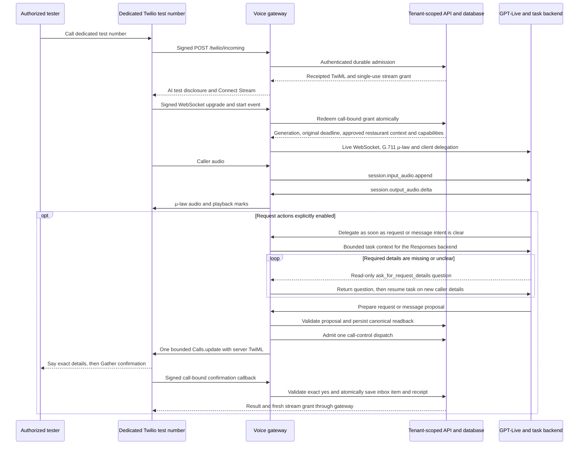

# Telephone voice sandbox

Hostline has an executable, disabled-by-default Twilio Media Streams ↔ OpenAI GPT-Live gateway (with an explicit legacy Realtime option). Its authoritative call admission, stream grants, callback receipts, proposal confirmation, and control state now live in the tenant-scoped database. Optional test flags allow saving reservation **requests** or messages to the staff inbox after a server-controlled readback and explicit spoken confirmation, and allow a configured staff transfer. A saved request does not reserve a table, notify staff externally, or verify the caller's identity.

Deterministic tests use fake provider transports. Separate authorized account checks and synthetic GPT-Live audio probes are recorded below; they do not establish a completed telephone request workflow. Production startup remains blocked. Dedicated-number acceptance tests are still required before any customer calls.

At most one reservation request or message can be saved per phone call. FAQs and a configured transfer can continue afterward; multiple saved items in one call are outside this foundation.

Restaurant owners can also restrict persisted phone permissions and inspect unresolved calls through [phone operations](PHONE_OPERATIONS.md). Tenant policy cannot override the disabled environment ceilings. Private staff dashboard context is labeled untrusted; it does not verify a caller, confirm a proposal, or provide a spoken warm-transfer introduction.

“Sandbox” here means Hostline's isolated application test mode. It does not mean the Twilio WhatsApp Sandbox, and Twilio's REST test credentials do not provide a real incoming audio call. A real voice test requires an authorized dedicated voice number and its account credentials; trial-account restrictions and provider charges can still apply.

## How a test call reaches the AI



The restaurant can eventually keep its public number by forwarding its carrier to the dedicated Twilio number. Carrier forwarding, original caller ID, forwarding conditions, human escalation, outage routing, and rollback require separate verification. **For this release, call the dedicated test number directly; do not forward customer calls to the sandbox.**

## Configuration

Inject secrets through the environment secret store. The development entrypoints load an ignored `.env` file if present; injected environment variables take precedence. Do not paste secrets into chat, source, browser settings, screenshots, or command-line arguments. The API and gateway require matching server-side identity, tenant, public origin, and capability settings.

| Variable                     | Requirement / default                                                                                                                                           |
| ---------------------------- | --------------------------------------------------------------------------------------------------------------------------------------------------------------- |
| `LIVE_VOICE_ENABLED`         | `false` by default; set `true` only for an authorized isolated test.                                                                                            |
| `VOICE_MODE`                 | Must explicitly be `sandbox` when enabled.                                                                                                                      |
| `VOICE_ACTIONS_ENABLED`      | Exact `true` or `false`; defaults `false`. Enable on both API and gateway only to test confirmed request/message saving. It never enables live vendor bookings. |
| `VOICE_TRANSFERS_ENABLED`    | Exact `true` or `false`; defaults `false`. Enable on both API and gateway only after approving an independent staff destination.                                |
| `TWILIO_ACCOUNT_SID`         | Account owning the dedicated voice test number; verified callbacks and stream account must match.                                                               |
| `TWILIO_AUTH_TOKEN`          | Server-only Twilio callback signature validation and call-control credential.                                                                                   |
| `TWILIO_PHONE_NUMBER`        | Dedicated platform test number in E.164 format, e.g. `+12125550142` (synthetic example).                                                                        |
| `OPENAI_API_KEY`             | Server-only API key with GPT-Live and Responses backend access and account spending controls.                                                                   |
| `VOICE_PUBLIC_URL`           | Exact public HTTPS gateway origin, without credentials, path, query, or fragment.                                                                               |
| `API_INTERNAL_URL`           | Defaults to `http://127.0.0.1:3001`; remote origins must use HTTPS.                                                                                             |
| `VOICE_SERVICE_TOKEN`        | At least 32 characters; matching scoped API credential. Never sent to Twilio or OpenAI.                                                                         |
| `VOICE_TENANT_ID`            | Configured tenant UUID on API and gateway. Model arguments and callback parameters cannot choose a tenant.                                                      |
| `VOICE_PORT`                 | `3002`, with `PORT` as fallback; listener binds to loopback.                                                                                                    |
| `OPENAI_REALTIME_MODEL`      | Defaults to `gpt-live-1`. Legacy `gpt-realtime` and `gpt-realtime-mini` remain explicit rollback options. The existing variable name is retained.               |
| `OPENAI_VOICE_BACKEND_MODEL` | Defaults to and currently supports `gpt-6-luna` for bounded GPT-Live task delegation.                                                                           |
| `VOICE_DEBUG_TRANSCRIPTS`    | Exact `true` or `false`; defaults `false`. Opt-in private local text capture for the nonproduction, loopback GPT-Live demo sandbox only; see below.             |
| `VOICE_MAX_CONCURRENT_CALLS` | Defaults to `2`; supported range 1–10. Persistent API admission is authoritative.                                                                               |
| `VOICE_MAX_CALL_SECONDS`     | Defaults to `300`; supported range 15–600. Original persisted call deadline survives resumed streams.                                                           |

`NODE_ENV=production` rejects enabled voice. Removing that gate requires completing and reviewing the production controls, not relabeling an environment.

Run the API with internal voice identity configured, then `pnpm dev:voice`. With voice disabled, `/health` works and incoming calls return 503 without opening OpenAI. Health returns capability flags, configured model names when enabled, and production status, never secrets or phone numbers. These fields report configuration, not provider acceptance evidence.

The **Phone operations** policy controls allow new calls, request/message saving, and staff transfers. Fresh synthetic policy records permit these actions, but each effective capability is also restricted by its environment flag. Owners update policy with CSRF and a current-version check. Every policy version change invalidates calls, grants, and pending consent admitted under an earlier version, including after reenablement; it does not require restarting the gateway to restrict API writes. Environment changes still require process restart. Reenabling policy permits new calls under configured capabilities, rather than reopening old calls.

The API's owner-triggered provider-status reader optionally needs `TWILIO_AUTH_TOKEN` as well as configured `TWILIO_ACCOUNT_SID` and `VOICE_TENANT_ID`. Gateway credentials are not implicitly available to a separate API process. If these are missing, status checks report unavailable and retain capacity without making a provider request. This sandbox uses the account auth token; production scoped API-key/credential separation and verified access management remain launch work. No new API-key environment variables are introduced here, and a status-read credential does not enable any voice capability.

Use an authorized TLS reverse proxy or development tunnel supporting long-lived WebSockets. Expose only the gateway; keep the internal API and demo dashboard private. The public HTTPS origin must exactly match `VOICE_PUBLIC_URL`; Host and forwarded headers never select signature-verification origins.

## Twilio setup to perform manually for a test

These steps prepare a dedicated test line; the scripts do not purchase numbers or change routing.

1. Select an existing dedicated **test** voice number owned by the configured account. Confirm trial restrictions, permission to use the line, and account spending controls.
2. Set incoming voice webhook to `https://<gateway-origin>/twilio/incoming`, method **POST**, with no query or trailing slash. Configure the call status callback as `https://<gateway-origin>/twilio/status`, **POST**, where supported by the number/account configuration.
3. Configure an independent provider-hosted failure route for an unreachable gateway. Trailing TwiML handles a stream ending while Twilio resumes instructions; it cannot serve an outage if this gateway is unreachable. No external failure route is provisioned by this repository.
4. Start with both action flags `false`. Call the dedicated number from an authorized tester's phone; verify the AI disclosure, correct restaurant facts, two-way audio, interruptions, hangup, and unavailable-action wording.
5. To test request saving, enable `VOICE_ACTIONS_ENABLED` on API and gateway and restart both. Use synthetic guest details. Hear the full deterministic readback, then say an unambiguous “yes.” Verify exactly one inbox item, the saved-request wording, correction/no-input behavior, replay handling, and stale-configuration rejection. A spoken yes is task confirmation, **not identity authentication**.
6. Before transfer tests, approve a separate staff number and verify it does not forward back to the AI. Restaurant `transferEnabled` and the test flag must both be enabled. The server rejects destinations equal to either the Twilio number or the restaurant's public forwarded number. Test human request, answer, busy, no-answer, failure, child-leg callbacks, original call budget, and reconnection.
7. After testing, disable/restart/drain the gateway and restore the dedicated number's routing as appropriate. Updating an environment variable alone does not alter a running process.

The server emits short-lived grants as Stream custom parameters, not URL query parameters. Incoming callbacks are verified with the official Twilio SDK against the exact configured HTTPS URL. Media upgrade signatures accept only the fixed configured WSS URL and its HTTPS equivalent. Verify actual Twilio/proxy behavior without adding a signature bypass.

## Enforced authorization and lifecycle

- The gateway checks SDK signatures over all parsed form fields, expected account and inbound called number, bounded body size, exact path, and identifier format. Confirmation paths contain 64-character opaque tokens. Child Number status callbacks use a different outbound leg and destination; they still require a valid account signature and the API's call-bound transfer nonce. They are not incorrectly treated as a new inbound call.
- The API persists callback receipts, call state, original deadline, generations, hashed grants, canonical proposals, and dispatch state. A grant is consumed atomically before any OpenAI connection. Replays and late terminal callbacks cannot reopen spent or ended calls, including after ordinary process restart. Terminal status arriving before the incoming callback creates an ended tombstone. This is not a database-restore recovery-epoch guarantee.
- Tenant identity comes from scoped service configuration and a restricted tenant transaction. The gateway validates internal response schemas, matching tenant IDs and restaurant scope, three-second deadlines, 128 KiB success/4 KiB error response limits, and no redirects. The provider host is fixed to `api.openai.com`.
- Action tools only prepare a request/message or request an allowlisted transfer. The Live backend also has a read-only clarification function when request actions are enabled. No model tool saves, confirms, books, authenticates a caller, chooses a tenant, supplies a staff number, or returns a success receipt. Both API and gateway capabilities must allow the action.
- Current persisted phone policy and its admission version are checked at API authorization boundaries, including dispatch and confirmation. The gateway checks authority before opening OpenAI, before releasing Live audio/delegation or a legacy Realtime response, and through a heartbeat five seconds after the preceding check completes. Checks time out after three seconds; idle detection is approximately eight seconds plus event-loop scheduling, not instant knowledge refresh. A successful output check may be reused for at most one second. Revocation, changed restaurant knowledge, invalid/expired authority, or an unavailable check clears queued audio and closes both peers. During deterministic control, immediate API checks govern dispatch/confirmation while audio heartbeat ownership is paused. Local audio closure alone retains the unresolved physical-call capacity hold.
- Relative dates use a server timestamp bound to the caller speech containing the date expression. Live transcript-fragment positions and legacy Realtime VAD positions must reference authenticated media already appended to the model before becoming usable date handles. Server-issued opaque handles are retained across later name/phone details, so crossing midnight cannot silently re-anchor “tomorrow.” Unknown handles and model-supplied timestamps are rejected. Once read back, the server freezes the explicit date and configuration version.
- For request saving, canonical `<Say>` finishes **before** `<Gather>` starts listening. The signed callback is bound to the current call, control, proposal, expiry, and exact server fields. The API accepts a narrow explicit-yes allowlist and rejects corrections and compound statements. Optional confidence must be finite and within 0–1; it is diagnostic metadata, not an acceptance cutoff or identity check. Save, call outcome, receipt, audit event, and outbox work commit atomically.
- The API admits one call-control dispatch before the gateway issues a single bounded Twilio update. A repeat dispatch cannot repeat the external update. Accepted, rejected, and uncertain results remain distinct. Timeouts, cancellation after dispatch, transport errors, or lost acknowledgement do not authorize retries. Unknown results enter reconciliation; a later genuine callback can establish the observed result. Definite rejection restores the stream only after that result is persisted.
- Policy edits serialize with durable dispatch admission. An update admitted before an edit can still reach the provider afterward; revocation does not cancel that in-flight authorization. Request confirmation rechecks current policy before saving, and outcome callbacks can reconcile the admitted update.
- Stream closure during controlled readback or transfer does not end the durable parent call. Terminal provider status ends it. Transfer callback results cannot overwrite newer generations; failures can resume with a fresh single-use grant. A successful Dial bridge is evidence of connecting call legs, not proof that a staff member understood context or fulfilled a reservation.
- Original call expiry is returned on redemption and bounds each resumed audio stream. Controlled REST updates include the same configured provider `timeLimit`, and Dial receives a remaining-budget bound. Provider enforcement and readback timing remain unverified. Conservative database capacity holds nonterminal calls until provider-terminal evidence instead of reclaiming a possibly active call merely because its local lease expired.

## Audio behavior and limits

Audio is μ-law, 8 kHz, mono. HTTP bodies are limited to 16 KiB and media frames to 8 KiB. Provisional sockets have a synchronous cap of twice configured call concurrency and a five-second start timeout. Setup must finish within ten seconds; pre-ready buffering is capped at two seconds/150 frames. Sequence numbers, timestamps, audio rate, playback queue, transport backpressure, and duration are bounded. Closing a call cancels any in-flight control transport and cleans up both audio peers.

Incoming WebSocket traffic uses separate per-socket token budgets. Credit refills continuously up to the burst ceiling; it does not reset at a one-second boundary or grow without bound during silence. Clock rollback cannot add credit.

| Budget                               | Burst ceiling | Refill per second | Failure code               |
| ------------------------------------ | ------------: | ----------------: | -------------------------- |
| All messages, charged before parsing |  450 messages |      350 messages | `media_message_rate_limit` |
| Non-mark media/control events        |    250 events |        250 events | `media_frame_rate_limit`   |
| Schema-valid playback marks          |     200 marks |         100 marks | `media_mark_rate_limit`    |
| Decoded inbound PCMU audio           |  24,000 bytes |       8,000 bytes | `media_audio_rate_limit`   |

Marks consume the overall and mark budgets, never the caller-audio budget. Unknown or stale marks remain bounded and receive no playback credit. Protocol/account/stream binding, sequence checks, audio decoding and playback queue limits still apply. Tests reproduce the old shared-window rejection of 200 mark acknowledgments plus 51 ordinary media frames, and the rejection of normal audio immediately after a bounded catch-up burst. The separate budgets accept these cases while still rejecting floods and sustained accelerated audio. They do not establish which threshold ended the earlier 145-second phone call.

The default adapter follows the continuous protocol described in [GPT-Live migration](#gpt-live-migration). The explicit legacy Realtime adapter uses GA `session.update`, `audio.input/output.format: {type:"audio/pcmu"}`, `response.output_audio.delta`, and bounded 384-token audio responses. Legacy tracing is disabled; input transcription and recordings are not requested. With actions enabled, server VAD response creation is controlled explicitly; GA `conversation.item.added` and legacy `conversation.item.created` acknowledgements are handled once per utterance. Preparation freezes new speech/model responses while deterministic control starts. Legacy clarification waits for the previous response's completion/cancellation acknowledgement, including acknowledgements arriving during asynchronous handoff.

In legacy Realtime FAQ-only mode, an answer that reaches `max_output_tokens` may finish playing and the session remains available for the next caller turn. It does not automatically request more output. The same incomplete result with actions or transfers enabled, a content-filter stop, an unknown incomplete reason, or a failed response still closes the stream. Prompts request short answers; the response and overall call budgets remain enforced.

Legacy Realtime caller interruption cancels active output, clears Twilio's queue, and truncates model context at the last acknowledged mark. Marks are emitted at most 100 ms apart. Late clear acknowledgements cannot claim discarded audio was heard. Completed queued output is cleared/truncated without cancelling a completed response.

If a legacy Realtime response completes just before its cancellation reaches OpenAI, a `response_cancel_not_active` error is recoverable only when its type and client event ID match an outstanding local cancellation. Other provider errors still close the stream. The gateway emits allowlisted diagnostic codes described below.

Prompts contain minimized approved restaurant knowledge; public/staff numbers, internal IDs, and credentials are omitted. Caller audio is not recorded, and ordinary operational logs exclude conversation content. Transcript persistence defaults off; explicitly authorized [local transcript debugging](#local-transcript-debugging) can capture bounded text separately. Confirmed request details and canonical readback are persisted as workflow data. This does not establish provider-side zero retention; account/processor settings need verification.

Both adapters receive the short AI-disclosure greeting, approved knowledge, and capability limits. Legacy Realtime omits per-response instruction overrides so the first response inherits the full session prompt, and resumed sessions report the authoritative outcome instead of greeting again. Live resumes after the API's spoken outcome with “How else can I help?” English is the prompted default throughout the conversation; a language change requires an explicit caller request, and accent, isolated words, and unclear audio must not trigger a switch. These are model instructions, not a deterministic language guarantee; telephone acceptance remains necessary.

The bounded caller-reason/handoff summary is AI-prepared untrusted workflow context, available only through permitted staff/owner dashboard details. Unconfirmed proposed fields remain labeled separately from saved inbox records. Viewer lists are minimized. Browser responses exclude raw provider IDs, grants, callback tokens, TwiML, credentials, audio, and full transcripts. This context does not establish human pickup or delivery of a private introduction to the staff phone.

## Operational diagnostics

Static `voice.workflow` stages identify session readiness, delegation, backend start/reply/tool/waiting/staleness/cancellation/failure, tool/date-reference rejection, proposal or transfer preparation, dispatch outcomes, and confirmation outcomes. After authenticated redemption, gateway events use the durable internal call UUID as their correlation ID, matching API events and resumed streams; earlier events use a random local ID. `voice.control_error` retains only allowlisted application codes from bounded 4xx responses. Events exclude caller text, tool arguments, provider identifiers, phone numbers, tokens, credentials, raw errors, audio and transcripts.

The API emits `request_saved` only after the transaction containing the inbox item, call outcome, audit, outbox and receipt has committed. Rolled-back work emits no success event; replayed confirmation does not emit another save. Diagnostic sink failures cannot undo a committed save or change authorization. Backend completion, a prepared proposal or accepted dispatch does not prove a saved request, completed readback or heard speech. These stage events help locate a failure without reconstructing the conversation.

## Local transcript debugging

`VOICE_DEBUG_TRANSCRIPTS=false` is the default. The project owner explicitly authorized local text capture to investigate the test conversation. Enable it on both API and gateway only for that authorized, nonproduction demo sandbox: voice must be enabled, `AUTH_MODE=demo`, the gateway must bind to loopback, and the model must be `gpt-live-1`. Set the same flag in both services' environments; agreement is an operator requirement, not an enforced cross-service check. Restart the services after changing the flag. The caller introduction adds a short notice that a transcript is saved locally for debugging. This option does not authorize customer traffic or change phone permissions, budgets, proposal validation, or canonical readback and confirmation.

The gateway captures validated, admitted caller-recognition and generated-assistant fragments exactly as received, labeled with speaker and approximate start/end timing. Records correlate through the internal call UUID and, for authenticated streams, generation. It also captures accepted current backend replies/questions, normalized validated tool proposals, and static workflow stages. The API captures the exact server readback, verified nonreplayed `<Gather>` `SpeechResult`, server outcome and workflow stages only after the containing transaction commits. Failed transactions leave no API capture; separate gateway stage codes can still describe the failure. No provider identifiers or date-reference handles are included in proposal text.

Private JSONL files live under the ignored `.data/voice-transcripts/api/` and `.data/voice-transcripts/gateway/` directories, with bounded slot directories beneath each. Directories use mode `0700` and files `0600`. Each component permits at most 100 files, 256 KiB per file, and a pending queue bounded by both 512 KiB and 512 events. Files expire 24 hours after creation; later writes do not extend that lifetime. Cleanup runs at startup and every minute while the recorder is active. Expired files can remain while services are stopped and are removed at the next cleanup. Capture errors or exhausted bounds drop capture without interrupting audio, a save, or call control; records can therefore be incomplete.

To locate files privately from the repository root, list paths without printing their contents:

```sh
rg --files --hidden --no-ignore .data/voice-transcripts
```

These files can contain personal details. Inspect only the needed records privately; do not dump their raw contents into shared terminals, ordinary logs, chat, or commits. There is no HTTP or dashboard transcript endpoint. This feature records no audio, requests no new vendor transcription, and keeps OpenAI Live and Responses `store: false`. Recognized text can be wrong; generated assistant text and server readback record what was generated or prepared, not proof that the caller heard it. Provider processing/retention settings still need separate verification.

The latest user-provided call logs established `CALL_BUDGET_EXCEEDED` after repeated callback-number questions. This capture milestone adds evidence for future diagnosis; it does not fix the reported wrong callback number, repeated questioning, or robotic confirmation voice.

For this capture revision, `pnpm check` passed **603 tests, 18 skipped, across 31 passing suites and one skipped suite**, plus formatting, lint, strict TypeScript, credential-pattern checks and builds, in a credential-free temporary source copy using Node 24.19.0 and pnpm 11.19.0. Independent capture review found no blocker. The earlier test and live-probe results below describe their respective revisions.

Local capture is now enabled from the same ignored environment configuration in the API and gateway. After read-only provider confirmation that no calls were active, queued or ringing, the old processes were stopped and one API and one gateway restarted. Private capture directories had mode `0700`. API readiness, dashboard and local/public gateway health returned HTTP 200; an unsigned incoming webhook returned 403. Authenticated phone operations showed 14 calls and no capacity holds. Provider readback confirmed existing incoming/status URLs and methods and the independent fallback remained correct. These checks placed no phone call. The next real test call's notice, bounded private records and end-to-end capture remain pending; setup checks do not establish phone acceptance.

## Confirmation and collection repair

The initial bounded retry was not sufficient: the next captured call returned two recognized affirmative answers below the old 0.8 threshold. Optional valid confidence is now diagnostic metadata, while an exact permitted affirmative and every existing call/proposal authorization, expiry and replay check decide whether a request saves. Empty input and unsupported keypad digits retain one bounded retry. The transcript also showed repeated name/time questions; backend input now joins consecutive same-speaker fragments exactly, preserving every original date handle and timestamp, and clarification selects one field with a fixed server question. See [current implementation evidence](IMPLEMENTATION_STATUS.md#confirmation-and-repeated-question-repair--2026-10-03) and [confirmation behavior](TWILIO_CALL_CONTROL.md#request-readback-protocol). Model speech and extraction still need dedicated-number acceptance.

## Missing terminal callbacks and provider status

Conservative capacity can remain held when a terminal callback is missing. An authenticated owner may use **Check provider status** from **Phone operations**. The API performs a read-only official Twilio parent lookup and one bounded child page of at most 20 under a three-second deadline, using configured server credentials and fixed account/call targets. No call update, hangup, redial, routing change, or request resubmission is sent.

Only complete bound terminal parent and child evidence, applied to the still-current local version, can release that hold. Missing credentials, failed/unavailable reads, 404, unknown status, truncated child results, contradictory bindings, active child legs, or stale state retain capacity. A concurrent local change causes a version conflict rather than applying old evidence. The browser cannot select provider IDs or manually release a hold. See [phone operations](PHONE_OPERATIONS.md) for credentials, roles, and investigation steps.

## Verification and remaining release gates

Run `pnpm exec vitest run tests/live-relay.test.ts tests/live-backend.test.ts tests/media-rate.test.ts tests/voice-transcript.test.ts tests/voice.test.ts tests/voice-actions.test.ts tests/call-control.test.ts tests/voice-domain.test.ts tests/voice-database.test.ts tests/voice-api.test.ts` for the relevant suites. The tests exercise actual Fastify/WebSocket routes, signatures, call bindings, fake provider events, durable API/database behavior, confirmation, dispatch races, interruption, date handles, local capture boundaries, and failure states. All vendor transports in these suites are fake; passing tests do not establish actual carrier behavior, speech quality, costs, or provider interoperability.

Protocol references include the installed official OpenAI GA Realtime schema and Twilio SDK types, [OpenAI Realtime](https://platform.openai.com/docs/guides/realtime), [Twilio Media Streams messages](https://www.twilio.com/docs/voice/media-streams/websocket-messages), [Stream TwiML](https://www.twilio.com/docs/voice/twiml/stream), and [Call resource](https://www.twilio.com/docs/voice/api/call-resource). Recheck provider documentation and account behavior during live acceptance.

Production remains blocked until:

1. Authorized dedicated-number acceptance verifies actual signatures/fields, Live events and delegation, format negotiation, audio/noise/latency, queued interruptions, confirmation recognition/corrections, no-input, stale configuration, single saved item, transfer outcomes/leg identity, callback races, provider time limits, outage fallback, and drain behavior. Any legacy rollback also requires the corresponding Realtime acceptance.
2. Bounded current-policy/configuration checks and owner-triggered read-only reconciliation are verified with real provider behavior and operating procedures. Account/tenant spending controls, redacted metrics/alerts, idle handling, retention/deletion, recovery epochs, and restore quarantine remain launch work. Missing or unverified terminal evidence retains capacity; the status check does not provide manual release or uncertain redrive.
3. Multi-instance/region operations, native PostgreSQL isolation/TLS/backup/restore, persistent staff sessions/revocation, MFA, scoped account access, and provider/processor data-region and retention terms are verified. Ordinary restart-safe persistence is not proof of safe restored-database replay protection.
4. The restaurant approves the pilot's actions, knowledge, staff destination, disclosure, and forwarding/rollback plan. Private staff dashboard context and the limited provider status check require real acceptance; a spoken warm-transfer introduction and broader recovery tooling remain separate work. OpenTable/Resy remain separately disabled until approved official access and conformance checks exist.

This is an executable, gated telephone test flow with locally tested control boundaries. It is not a finished customer phone deployment or a live table-booking integration.

## GPT-Live migration

The default voice path uses `gpt-live-1`, Marin, and matching 8 kHz PCMU over `/v1/live/sessions`. The gateway streams audio continuously; it does not send Realtime audio commits, response triggers, cancellations, or truncation commands. Caller interruptions are handled by the Live model. Twilio playback marks bound the local output queue to two seconds; canonical readback and fallback still use Twilio speech. Those separate voices require a listening comparison on the test line.

Client delegation joins consecutive same-speaker fragments into readable text without adding, removing or reordering text. Each caller group maps all original date handles and timestamps to UTF-16 start/end offsets; grouping does not create a new date authority or infer utterance boundaries. It sends this bounded in-memory snapshot to a stateless `gpt-6-luna` Responses request, with `store: false`, a 12-second deadline, one function call at most and no automatic transport retry. The Live prompt delegates when a supported request or message intent becomes clear, before collecting every field; the backend owns missing-detail collection. Simple approved restaurant FAQs stay with the voice model. Prompts guide delegation but do not guarantee that a live model will delegate.

Enabled preparation/transfer functions and the action-gated, read-only `ask_for_request_details` function use strict JSON schemas. Every schema property is required; only domain-optional fields such as reservation notes and transfer context may be null, and those nulls are removed before existing domain/relay validation. Required guest details and server date handles remain non-nullable. Unknown fields and unauthorized tools are rejected.

`ask_for_request_details` supplies a task kind and one required-field enum; the server validates that the field applies to that task and supplies a fixed single-field question. It cannot prepare or save anything. Its validated result explicitly marks the task as awaiting caller details. A new caller fragment can then resume the same known delegation without depending on another model delegation event. Ordinary unmarked replies settle the task; the backend is instructed to use an ordinary reply when the caller cancels. New delegation IDs supersede prior unfinished work, and newer caller fragments invalidate pending backend results. The relay allows at most 80 backend attempts per stream, coalesces fragment bursts, rejects results superseded by received caller fragments, and runs one task handoff at a time. Disconnects abort backend requests. Transcript fragments remain in bounded memory by default; [local transcript debugging](#local-transcript-debugging) is a separate explicit opt-in. Ordinary logs exclude conversation content, and Live recording/fork storage is disabled. This does not establish account-wide provider retention settings.

User transcript fragments receive server-generated reference handles and timestamps derived from their position in the input audio stream. These are approximate fragment references, not exact VAD utterance boundaries. A bounded queue tolerates transcript timing up to one second ahead of forwarded audio, but admits the fragment and its date handle only after its entire audio interval has been forwarded. New caller fragments invalidate stale backend work immediately, even while awaiting that interval. The backend must preserve the handle for the caller's date expression across later contact details and use a new handle when the date changes. The backend additionally grounds the literal date expression within the model-selected caller group, preserving a correct reference or selecting the original reference at the beginning of a unique exact match. Missing or ambiguous grounding produces a date question rather than a proposal; no dates are computed and no other group is searched to substitute a reference. Canonical readback states the exact resolved date before confirmation; ambiguous dates need clarification. Midnight and delayed-fragment behavior remain part of phone acceptance.

Continuous output and delegation cross current-policy checks, rather than relying on Realtime response-created events. On control takeover the relay clears queued audio and suppresses model speech while the existing API prepares canonical Twilio `<Say>` followed by `<Gather>`. No model or backend tool can save or confirm a request. On closure the relay aborts local work, sends `session.close`, and allows a bounded 1.5-second finalization window. Missing finalization is not evidence of final provider usage or a terminal Twilio call.

The initial migration checks on 2026-10-02 passed **462 tests, 18 skipped**. Authorized account checks passed GPT-Live session start/close and `gpt-6-luna` access. A synthetic audio probe through the Live relay produced a reservation proposal with a server-issued date handle and no protocol diagnostics; stale backend work was aborted and a subsequent delegation succeeded. This probe placed no phone call and saved no request.

After the delegation, strict-schema, diagnostic and arrival-budget improvements, `pnpm check` passed **558 tests, 18 skipped, across 30 passing suites and one skipped suite**, plus formatting, lint, strict TypeScript, credential-pattern checks and builds, in a credential-free temporary source copy using Node 24.19.0 and pnpm 11.19.0. Independent review found no actionable issues.

A two-turn synthetic audio probe through the actual Live relay passed session start and final closure, delegation on initial request intent before details, strict clarification, and exactly one reservation proposal with a server-issued date handle after the details arrived. It used two backend calls and a fresh delegation for the second call, with no failure diagnostics. Same-ID task continuation is covered by deterministic tests, not specifically established by this probe. Correcting the harness to pace audio in real time resolved its timestamp lookahead failures without changing production code or timing tolerance. No phone call, request save or call-control dispatch occurred.

After provider confirmation that the line was idle, the API and gateway restarted successfully. API readiness, dashboard, and local/public gateway health returned HTTP 200; the unsigned incoming webhook returned 403. Health reported `gpt-live-1`/`gpt-6-luna`, requests enabled, bookings/transfers disabled and production false. The dedicated number's voice/status URLs and methods matched the current tunnel on provider readback, with its independent fallback preserved. Actual phone confirmation, exactly one matching dashboard item, sustained audio/interruption behavior, and listening comparison between Live and Twilio voices remain pending. See [implementation status](IMPLEMENTATION_STATUS.md#gpt-live-migration-2026-10-02) for the evidence record and the earlier phone failure's unresolved cause.

References: [Live migration](https://developers.openai.com/api/docs/guides/live-migration), [WebSocket audio](https://developers.openai.com/api/docs/guides/voice-websockets), [delegation](https://developers.openai.com/api/docs/guides/live-delegation), and [session lifecycle](https://developers.openai.com/api/docs/guides/live-conversations).
