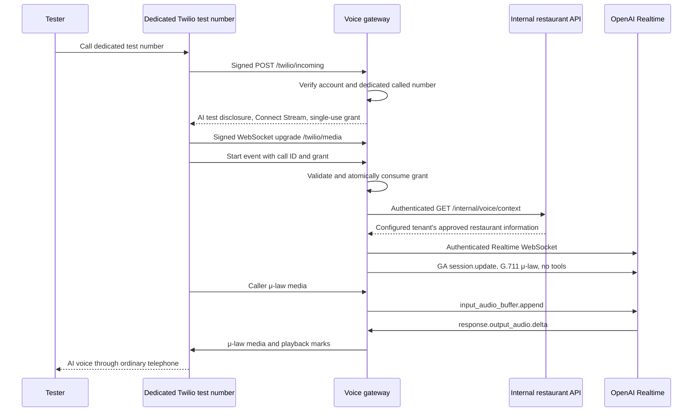

# Telephone voice sandbox

The executable voice gateway connects a dedicated Twilio test number to OpenAI Realtime for spoken restaurant questions. It is **disabled by default and restricted to a single-process sandbox**. No provider account was changed, number purchased, customer called, forwarding configured, or paid provider request made during implementation and automated tests.

The dashboard's scripted call simulator and staff request workflow are separate from this telephone bridge. **Telephone reservation requests, message saving, booking, customer lookup, and staff transfers are unavailable.** The phone greeting says this explicitly; the Realtime session has no tools. The assistant must not claim to have saved anything or notified staff. This bridge is useful for verifying audio, latency, interruptions, and approved FAQ behavior before adding independently authorized actions.

## How a test call reaches the AI

Later, the restaurant can keep its existing public number by configuring its carrier to forward to that dedicated Twilio number. Carrier forwarding, original caller-ID behavior, unconditional versus unanswered forwarding, and outage routing require verification with the carrier. **For this release, call the dedicated test number directly; do not forward customer calls to the sandbox.** Customer forwarding requires the release gates below, including usable staff escalation.

## Configuration

Inject secrets through the environment/secret store. Do not paste them into chat, source files, browser settings, screenshots, or command-line arguments. The development entrypoint loads an ignored `.env` file from the working directory if one exists; injected environment variables take precedence. Configure the API and gateway with matching internal service identity and tenant mapping.

| Variable                     | Requirement / default                                                                                                                                 |
| ---------------------------- | ----------------------------------------------------------------------------------------------------------------------------------------------------- |
| `LIVE_VOICE_ENABLED`         | `false` by default. Set to `true` only for an authorized isolated test.                                                                               |
| `VOICE_MODE`                 | Must explicitly be `sandbox` when enabled.                                                                                                            |
| `TWILIO_ACCOUNT_SID`         | Account owning the dedicated test number. Incoming callback and stream account must match.                                                            |
| `TWILIO_AUTH_TOKEN`          | Server-only Twilio request-signature validation secret.                                                                                               |
| `TWILIO_PHONE_NUMBER`        | Dedicated platform test number in E.164 form, such as `+12125550142` (synthetic example). This is **not** the restaurant's original forwarded number. |
| `OPENAI_API_KEY`             | Server-only API key with authorized Realtime access and account-level spending controls.                                                              |
| `VOICE_PUBLIC_URL`           | Exact public HTTPS origin for this gateway, without a path, query, or credentials. Example: `https://voice.example.test`.                             |
| `API_INTERNAL_URL`           | API origin; defaults to `http://127.0.0.1:3001`. HTTP is accepted only on loopback; remote origins must use HTTPS.                                    |
| `VOICE_SERVICE_TOKEN`        | At least 32 characters; same scoped service token on the API. This is never sent to OpenAI or Twilio.                                                 |
| `VOICE_TENANT_ID`            | UUID configured server-side on both API and gateway. No request parameter or model argument selects a different tenant.                               |
| `VOICE_PORT`                 | `3002`, with `PORT` as a fallback. Listener binds to `127.0.0.1`.                                                                                     |
| `OPENAI_REALTIME_MODEL`      | `gpt-realtime` by default; `gpt-realtime-mini` is also accepted. Verify availability, regional processing, quality, and price in your account.        |
| `VOICE_MAX_CONCURRENT_CALLS` | `2` by default; supported range 1–10 in this sandbox process.                                                                                         |
| `VOICE_MAX_CALL_SECONDS`     | `300` by default; supported range 15–600. Includes context/model setup after stream admission.                                                        |

`NODE_ENV=production` rejects enabled voice at startup. Setting production-like infrastructure variables does not remove that gate. Removing the gate requires implementation and review of the missing controls, rather than changing an environment label.

Run the API with the scoped internal voice endpoint configured, then run `pnpm dev:voice` with its environment loaded. With voice disabled, `GET http://127.0.0.1:3002/health` works and inbound calls return HTTP 503 without opening a provider connection. Health returns configuration flags, never credentials or phone numbers.

Use a TLS reverse proxy or authorized development tunnel that supports long-lived WebSocket upgrades, points only to the voice gateway, and preserves the configured path. Do not expose the dashboard's demo authentication to the Internet. An HTTPS tunnel URL must exactly match `VOICE_PUBLIC_URL`; host and forwarded headers do not determine signature verification. Keep the internal API private.

## Twilio configuration to perform manually for a test

These instructions prepare the integration; they do not authorize this repository's scripts to buy numbers or change routing.

1. Choose an existing dedicated **test** voice number in the configured Twilio account. Trial accounts can have separate calling restrictions and disclosures.
2. Set that number's incoming voice webhook to `https://<gateway-origin>/twilio/incoming`, method **POST**. Use the exact HTTPS origin configured in `VOICE_PUBLIC_URL`, with no query string or trailing slash on the route.
3. Set the number's call status callback to `https://<gateway-origin>/twilio/status`, method **POST**, where the Twilio account configuration supports it. Terminal statuses close the stream; media socket closure and the hard duration cap also clean up independently. Confirm actual callback fields and delivery in staging.
4. Configure an independent provider-hosted failure URL/TwiML message suitable for the test line. This gateway's trailing TwiML message handles an ended stream when Twilio resumes instructions; it cannot respond when the gateway itself is unreachable. Verify both failures in a real test. No external failure route is provisioned by this code.
5. Call the dedicated test number from an authorized tester's phone. Confirm that the AI test disclosure is heard before media setup, that restaurant knowledge matches the configured tenant, and that unavailable actions are explained honestly.
6. After a test, set `LIVE_VOICE_ENABLED=false`, restart/drain the gateway, and revert the dedicated number's test webhook as appropriate. Never assume setting an environment value changes an already-running process.

The server emits `<Connect><Stream>` with a WSS URL and a short-lived grant in a Twilio custom parameter, not a URL query string. Twilio's upgrade signature is checked against the configured WSS URL and its HTTPS upgrade equivalent using the official SDK. Both accepted URLs are fixed from configuration; incoming headers cannot change either. Verify the actual Twilio signature representation and proxy behavior during the first test, with no signature bypass if verification fails.

## Enforced behavior and bounds

- Official Twilio SDK signature checks include every parsed form parameter, followed by expected account/called-number and call-ID checks. Malformed forms, duplicate values, wrong accounts, unsupported request paths/queries, and forged callbacks are rejected. HTTP bodies are limited to 16 KiB; media WebSocket frames to 8 KiB.
- Only a verified callback can create a 30-second, 256-bit random stream grant. The first valid stream consumes it atomically in this process. A mismatched call ID, account, stream ID, media format, or spent/expired grant is rejected before opening OpenAI. Repeated callbacks return byte-for-byte identical TwiML; an ended stream cannot use that response to reenter the call.
- Callback replay records remain for the process lifetime, up to 10,000 calls. The gateway refuses new records when full rather than silently evicting replay protection. Active and unexpired pending calls share the configured concurrency limit. There are at most twice that number of provisional WebSocket connections, each with a five-second start timeout.
- Setup must complete within ten seconds after a stream start; API context fetch has a three-second timeout and a 128 KiB response limit. Invalid context or tenant mismatch prevents provider connection. Internal redirects are forbidden. The outbound voice host is fixed to `api.openai.com`, with no redirects and a five-second WebSocket handshake limit.
- Caller audio is G.711 μ-law, 8 kHz, mono. Input buffering before readiness is capped at 16,000 bytes (two seconds) and 150 frames. Incoming frames, audio rate, monotonic sequence/timestamp, output queue, transport backpressure, and total call duration are bounded. Exceeding a limit closes both peers and releases admission.
- The adapter uses OpenAI GA `session.update`, `audio.input/output.format: {type: "audio/pcmu"}`, `output_modalities: ["audio"]`, and `response.output_audio.delta`. No deprecated preview-only audio event name is assumed. Tracing is explicitly disabled; no input transcription or recording is requested.
- Caller interruption cancels an active response, clears queued Twilio audio, and truncates assistant context at the last acknowledged playback mark. Marks are sent at most 100 milliseconds apart. This is conservative: a partially heard chunk can be omitted from model context; unacknowledged audio is never represented as definitely heard. Late acknowledgements after a clear cannot resurrect discarded playback. A completed response with queued audio is cleared/truncated without sending cancellation for a completed response.
- The model gets a minimized snapshot of configured restaurant name, timezone, address, hours, closures, available menu items, and FAQs. Staff transfer numbers, public phone numbers, internal identities, and follow-up promises are excluded. Caller audio and model text are not persisted or logged by the gateway. This does **not** establish provider-side zero retention; verify account and processor settings separately.
- The greeting and model instructions clearly identify the test and unavailable actions. Prompts are not an authorization boundary: the absence of tools and action routes is what prevents a model from saving messages, booking, transferring, or accessing customer records. Spoken FAQ accuracy still requires evaluation.

## Automated checks and protocol sources

`pnpm exec vitest run tests/voice.test.ts` exercises disabled/production startup, signature/account/number/origin rejection, callback replay, expiration, single-use grants, media binding, an authenticated WebSocket handshake through the real Fastify route, μ-law event mapping, output interruption and playback marks, backpressure/buffer bounds, cleanup, and unavailable tool handling. All provider peers are fake; these tests need no vendor credentials, never call a provider, and are **not** evidence of actual carrier or voice quality.

Implementation was checked against these official sources:

- [OpenAI Node GA Realtime schema source](https://github.com/openai/openai-node/blob/main/src/resources/realtime/realtime.ts), inspected source blob `5fc449eaa9e0e6ba25b32266d3fc7afb3ba4f43a`: session audio formats, server VAD, `response.output_audio.delta`, response cancellation, item truncation, and trace configuration.
- [OpenAI Node WebSocket transport](https://github.com/openai/openai-node/blob/main/src/realtime/ws.ts), inspected source blob `029401fa0f98adb67c24434efa85097ce729d3b0`: server-side bearer authorization and WebSocket lifecycle.
- [Twilio Node webhook verification source](https://github.com/twilio/twilio-node/blob/main/src/webhooks/webhooks.ts), inspected source blob `a0cffb68945368afcfd62973c756f4bcac46e166`: official HMAC validation/canonicalization over the configured URL and form fields. Runtime uses the installed official SDK, not a custom validator.
- [Twilio Media Streams messages](https://www.twilio.com/docs/voice/media-streams/websocket-messages) and [Stream TwiML](https://www.twilio.com/docs/voice/twiml/stream) are the live staging reference for stream, mark, clear, and custom-parameter behavior. These pages and actual account behavior must be rechecked during acceptance; offline test fixtures do not certify them.

## Remaining release gates

This implementation intentionally keeps production activation blocked. Required work includes:

1. **Durable admission and recovery.** Move callback deduplication, grants, controller generation, recovery epoch, and call state into the authoritative tenant-scoped persistence layer. Current in-memory state is lost on restart and cannot coordinate replicas. Twilio signatures alone do not supply a replay timestamp. A captured signed callback can be replayed after restart; process-lifetime protection does not solve this. No live business mutations are exposed during this limitation.
2. **Voice actions and confirmation.** Connect turn-linked readback, exact confirmation, stale-configuration rejection, disconnect fencing, idempotency, and durable inbox writes to an internal call-bound authorization protocol. The simulator's button-driven confirmation is not evidence of spoken confirmation. Do not add a model tool that simply bypasses these rules.
3. **Real human escalation.** Implement and verify a bounded, server-allowlisted transfer state machine, independent destination verification, no-answer/busy handling, leg status reconciliation, and staff-only context delivery. Destinations must require `transferEnabled`, differ from both `TWILIO_PHONE_NUMBER` and the restaurant's forwarded `publicPhone`, and be verified not to forward back into the AI. The current bridge does not dial any destination, even if the restaurant has transfer settings.
4. **Freshness and operational controls.** Add current knowledge revocation checks, call control metrics with redaction, idle/silence behavior, distributed admission, account/tenant spending budgets, alerts, draining, operational disablement, restore quarantine, and a tested provider-hosted outage route. Current knowledge is a call snapshot; safety-critical changes do not refresh mid-call. Model output is capped at 384 tokens per response, but this is not an account-wide cost budget.
5. **Live acceptance.** Authorized dedicated-number tests must demonstrate webhook/upgrade signatures, actual call-start fields, format negotiation, two-way audio, delayed provider setup, latency, noise, interruption while audio is queued, completed-response interruptions, call hangup, malformed/replayed stream rejection, duration/concurrency limits, provider outage, and Twilio fallback. Check that unavailable tasks are never reported as completed. Record account model access, current provider limits, processor/data-region/retention settings, required AI disclosure, and costs.
6. **Customer pilot approval and production infrastructure.** Finish the repository's staff authentication, PostgreSQL isolation/operations, retention, monitoring, tenant onboarding, permitted actions, transfer, and restaurant approval gates. Then verify carrier forwarding on an agreed pilot window with an independent rollback route. OpenTable and Resy require their separate official access and conformance gates; adding telephone audio does not enable either connector.

Do not advertise this sandbox as a finished customer phone receptionist, a verified transfer system, or a live reservation integration. Its delivered behavior is an executable, bounded voice conversation foundation with explicit next acceptance steps.
